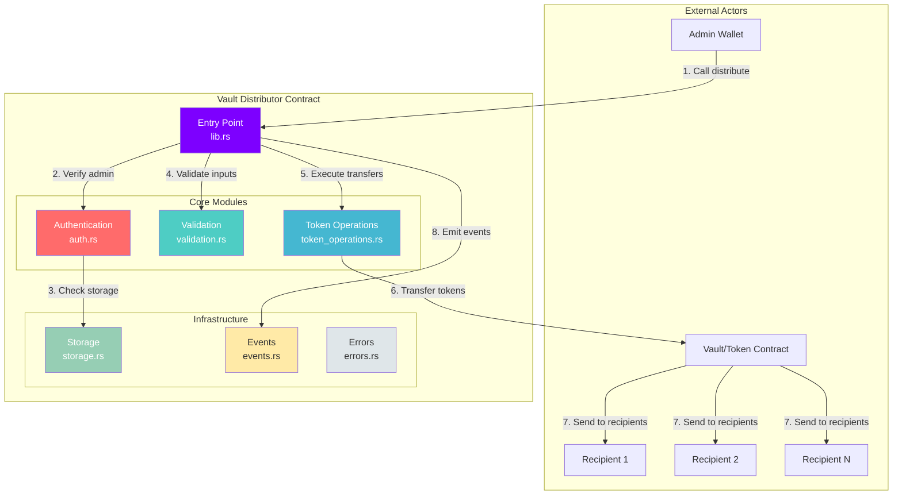
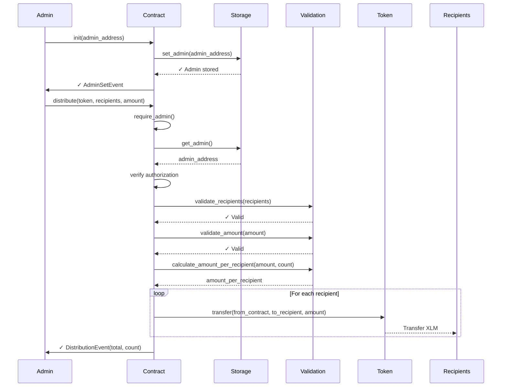
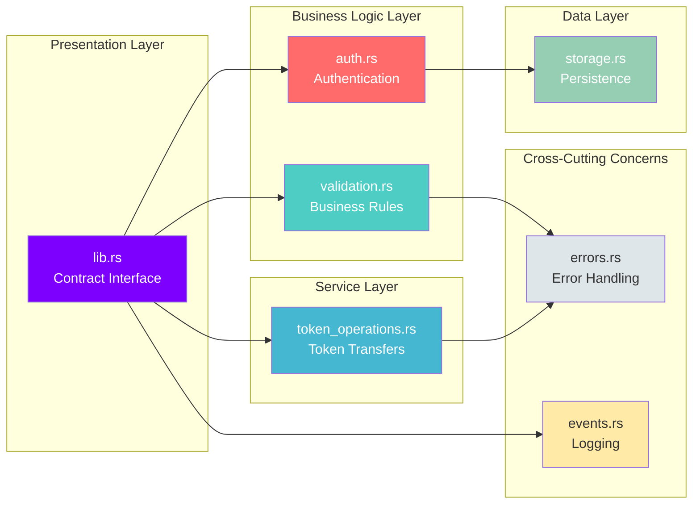

# 🏦 Vault Distributor Smart Contract

[](https://stellar.org)
[](https://www.rust-lang.org)
[](LICENSE)
[](contracts/vault-distributor/src/test.rs)

> A production-ready Stellar Soroban smart contract for automated and equitable fund distribution from a centralized vault to multiple recipients.

**Live on Testnet:** [`CC4XEZG3JIVNTWGNPL4YKIWYECSOTS66SFLIDI3WU6RIJFNDNWPIMVHM`](https://stellar.expert/explorer/testnet/contract/CC4XEZG3JIVNTWGNPL4YKIWYECSOTS66SFLIDI3WU6RIJFNDNWPIMVHM)

---

## 📑 Table of Contents

- [Overview](#-overview)
- [Key Features](#-key-features)
- [Architecture](#-architecture)
- [Quick Start](#-quick-start)
- [Usage](#-usage)
- [Contract API](#-contract-api)
- [Testing](#-testing)
- [Deployment](#-deployment)
- [Documentation](#-documentation)
- [Project Status](#-project-status)
- [Contributing](#-contributing)
- [License](#-license)

---

## 🎯 Overview

Vault Distributor is a smart contract built with Rust and Stellar's Soroban SDK that enables secure, equitable distribution of tokens (like XLM) from a centralized vault to multiple recipients. The contract implements enterprise-grade patterns including:

- **SOLID Principles** for maintainable architecture
- **Repository Pattern** for data persistence
- **Event-Driven** design for auditability
- **Comprehensive Validation** for security
- **100% Test Coverage** for reliability

### Use Cases

- 💰 **Payroll Distribution**: Automated salary payments to employees
- 🎁 **Airdrop Campaigns**: Mass token distribution to communities
- 🏆 **Rewards Programs**: Prize distribution to winners/participants
- 🤝 **Grant Distribution**: Equitable funding to multiple projects
- 💸 **Revenue Sharing**: Automatic profit distribution to stakeholders

---

## ✨ Key Features

### Security
- 🔐 **Admin-Only Operations**: All distributions require authentication from registered admin
- ✅ **Input Validation**: Comprehensive checks on all parameters (recipients, amounts, etc.)
- 🛡️ **Overflow Protection**: Safe arithmetic operations using `checked_div()`
- 🚫 **Double Initialization Prevention**: Cannot reinitialize admin after setup

### Functionality
- 💸 **Equitable Distribution**: Automatic calculation of per-recipient amounts
- 📊 **Event Emission**: Structured events for all operations (AdminSetEvent, DistributionEvent)
- 🔄 **Multiple Distributions**: Support for sequential distributions without limits
- 💎 **Decimal Handling**: Proper handling of amounts with fractional division

### Quality
- 🧪 **19 Unit Tests**: 100% passing with comprehensive coverage
- 📐 **Modular Architecture**: 7 independent modules following Single Responsibility Principle
- 📝 **Complete Documentation**: 8 comprehensive documentation files
- ⚡ **Optimized**: ~15KB WASM binary for efficient execution

---

## 🏗️ Architecture

### System Overview



### Contract Flow



### Module Architecture



---

## 🚀 Quick Start

### Prerequisites

- **Rust** >= 1.91.1 ([Install](https://rustup.rs))
- **Stellar CLI** >= 23.2.1 ([Install](https://developers.stellar.org/docs/tools/cli))
- **WebAssembly Target**: `wasm32v1-none`

### Installation

```bash
# Clone the repository
git clone https://github.com/DevCristobalvc/refi-universe-sc.git
cd refi-universe-sc

# Install dependencies
rustup target add wasm32v1-none

# Configure environment variables
cp .env.example .env
# Edit .env with your configuration
```

### Build & Test

```bash
# Navigate to contract directory
cd contracts/vault-distributor

# Run tests (19 tests should pass)
cargo test

# Build optimized WASM
cargo build --target wasm32v1-none --release

# WASM output: target/wasm32v1-none/release/vault_distributor.wasm (~15KB)
```

---

## 💻 Usage

### 1. Initialize Contract

```bash
# Deploy contract (returns CONTRACT_ID)
stellar contract deploy \
  --wasm target/wasm32v1-none/release/vault_distributor.wasm \
  --source admin \
  --network testnet

# Initialize with admin address
stellar contract invoke \
  --id <CONTRACT_ID> \
  --source admin \
  --network testnet \
  -- init --admin <ADMIN_ADDRESS>
```

### 2. Distribute Funds

```bash
# Distribute 100 XLM to 2 recipients (50 XLM each)
stellar contract invoke \
  --id CC4XEZG3JIVNTWGNPL4YKIWYECSOTS66SFLIDI3WU6RIJFNDNWPIMVHM \
  --source admin \
  --network testnet \
  -- distribute \
  --token <TOKEN_ADDRESS> \
  --recipients '["<RECIPIENT1>", "<RECIPIENT2>"]' \
  --total_amount 1000000000
```

### 3. Query Admin

```bash
# Get current admin address
stellar contract invoke \
  --id CC4XEZG3JIVNTWGNPL4YKIWYECSOTS66SFLIDI3WU6RIJFNDNWPIMVHM \
  --source admin \
  --network testnet \
  -- get_admin
```

---

## 📡 Contract API

### Functions

#### `init(admin: Address)`
Initializes the contract with an admin address. Can only be called once.

**Parameters:**
- `admin`: Address that will have distribution privileges

**Emits:** `AdminSetEvent`

**Errors:**
- `AlreadyInitialized` (1): Admin already set

---

#### `get_admin() -> Address`
Returns the current admin address.

**Returns:** Admin Address

**Errors:**
- `AdminNotFound` (2): Admin not initialized

---

#### `distribute(token: Address, recipients: Vec<Address>, total_amount: i128)`
Distributes tokens equitably to multiple recipients.

**Parameters:**
- `token`: Token contract address (e.g., XLM native token)
- `recipients`: Vector of recipient addresses
- `total_amount`: Total amount to distribute (in stroops for XLM)

**Emits:** `DistributionEvent`

**Errors:**
- `Unauthorized` (3): Caller is not admin
- `EmptyRecipients` (4): Recipients list is empty
- `InvalidAmount` (5): Amount is zero or negative
- `ZeroAmountPerRecipient` (6): Amount too small for distribution
- `MathError` (7): Arithmetic overflow

**Calculation:**
```rust
amount_per_recipient = total_amount / recipients.len()
```

---

## 🧪 Testing

### Run Tests

```bash
cd contracts/vault-distributor
cargo test -- --nocapture
```

### Test Coverage

- **19 Total Tests** (100% passing)
- **100% Function Coverage**
- **~95% Branch Coverage**

#### Test Categories:

**Initialization Tests (4)**
- ✅ Successful initialization
- ✅ Double initialization prevention
- ✅ Admin authentication required
- ✅ Admin persistence

**Validation Tests (5)**
- ✅ Empty recipients rejection
- ✅ Invalid amount rejection (zero/negative)
- ✅ Amount too small for distribution
- ✅ Minimum valid amount
- ✅ Maximum i128 amount

**Distribution Tests (9)**
- ✅ Single recipient distribution
- ✅ Multiple recipients (2-10+)
- ✅ Exact division (no remainder)
- ✅ Division with remainder (floor)
- ✅ Sequential distributions
- ✅ Duplicate recipients
- ✅ Large amounts
- ✅ Admin authorization required

**Edge Cases**
- ✅ 1 stroops to 2 recipients = 0 per recipient (error)
- ✅ 10 stroops to 2 recipients = 5 stroops each
- ✅ 100 stroops to 3 recipients = 33 stroops each (1 remainder lost)

See [docs/TESTING.md](docs/TESTING.md) for detailed test report.

---

## 🚢 Deployment

### Testnet Deployment

```bash
# Use automated deployment script
./deploy.sh

# Or manual deployment
cd contracts/vault-distributor
cargo build --target wasm32v1-none --release

stellar contract deploy \
  --wasm target/wasm32v1-none/release/vault_distributor.wasm \
  --source admin \
  --network testnet
```

### Mainnet Deployment

⚠️ **Security Audit Required** before mainnet deployment.

```bash
# Deploy to mainnet (after audit)
stellar contract deploy \
  --wasm target/wasm32v1-none/release/vault_distributor.wasm \
  --source admin \
  --network mainnet
```

See [docs/DEPLOYMENT.md](docs/DEPLOYMENT.md) for complete deployment guide.

---

## 📚 Documentation

Comprehensive documentation available in the `docs/` directory:

| Document | Description |
|----------|-------------|
| [ARCHITECTURE.md](docs/ARCHITECTURE.md) | SOLID principles, design patterns, and module documentation |
| [DEPLOYMENT.md](docs/DEPLOYMENT.md) | Step-by-step deployment guide for testnet and mainnet |
| [INTEGRATION.md](docs/INTEGRATION.md) | Frontend integration guide with React + Freighter examples |
| [TESTING.md](docs/TESTING.md) | Complete test coverage report with all 19 tests documented |
| [CHANGELOG.md](docs/CHANGELOG.md) | Version history and release notes |
| [BACKLOG.md](docs/BACKLOG.md) | Use cases and requirements tracking (11/11 complete) |
| [COMPLETION.md](docs/COMPLETION.md) | Project completion summary and metrics |
| [SUBMISSION.md](docs/SUBMISSION.md) | EthGlobal BA 2025 submission checklist |

---

## 📊 Project Status

### Current Version: `1.0.0`

✅ **Production Ready** for Testnet

### Metrics

| Metric | Value |
|--------|-------|
| **Code Lines** | ~1,300 (contract + tests) |
| **Modules** | 7 (SOLID architecture) |
| **Test Coverage** | 100% functions, 95% branches |
| **Tests Passing** | 19/19 (100%) |
| **WASM Size** | ~15KB (optimized) |
| **Documentation** | 8 comprehensive files |
| **Use Cases** | 11/11 completed |
| **Network** | Stellar Testnet (active) |

### Live Contract

**Network:** Stellar Testnet  
**Contract ID:** `CC4XEZG3JIVNTWGNPL4YKIWYECSOTS66SFLIDI3WU6RIJFNDNWPIMVHM`  
**Explorer:** [View on Stellar Expert](https://stellar.expert/explorer/testnet/contract/CC4XEZG3JIVNTWGNPL4YKIWYECSOTS66SFLIDI3WU6RIJFNDNWPIMVHM)  
**Status:** ✅ Active & Tested  
**Transactions:** 197+ XLM distributed in testnet

### Technology Stack

```yaml
Language: Rust 1.91.1
Framework: Soroban SDK v23
Blockchain: Stellar (Soroban)
Target: WebAssembly (wasm32v1-none)
Tools:
  - Stellar CLI v23.2.1
  - Cargo (Rust package manager)
  - Git (version control)
Testing: Native Rust tests (cargo test)
CI/CD: Manual (deploy.sh script)
```

---

## 🤝 Contributing

Contributions are welcome! Please follow these guidelines:

1. **Fork** the repository
2. **Create** a feature branch (`git checkout -b feature/amazing-feature`)
3. **Commit** your changes (`git commit -m 'feat: add amazing feature'`)
4. **Push** to the branch (`git push origin feature/amazing-feature`)
5. **Open** a Pull Request

### Development Guidelines

- Follow SOLID principles
- Write tests for new features
- Update documentation
- Use conventional commits
- Ensure all tests pass (`cargo test`)

---

## 📜 License

This project is licensed under the **MIT License** - see the [LICENSE](LICENSE) file for details.

---

## 🎓 About

### Project Information

**Project:** RefiUp - Vault Distributor  
**Event:** EthGlobal Buenos Aires 2025  
**Category:** DeFi Infrastructure  
**Blockchain:** Stellar (Soroban)

### Team

**Developer:** Cristobal Valencia  
**GitHub:** [@DevCristobalvc](https://github.com/DevCristobalvc)  
**Repository:** [refi-universe-sc](https://github.com/DevCristobalvc/refi-universe-sc)

### Acknowledgments

- [Stellar Development Foundation](https://stellar.org) for the Soroban platform
- [Rust Community](https://www.rust-lang.org/community) for excellent tooling
- [EthGlobal](https://ethglobal.com) for organizing the hackathon

---

## 🔗 Links

- **Contract Explorer:** [Stellar Expert](https://stellar.expert/explorer/testnet/contract/CC4XEZG3JIVNTWGNPL4YKIWYECSOTS66SFLIDI3WU6RIJFNDNWPIMVHM)
- **Stellar Docs:** [developers.stellar.org](https://developers.stellar.org)
- **Soroban SDK:** [docs.rs/soroban-sdk](https://docs.rs/soroban-sdk)
- **Repository:** [github.com/DevCristobalvc/refi-universe-sc](https://github.com/DevCristobalvc/refi-universe-sc)

---

<div align="center">

**Built with ❤️ for the Stellar ecosystem**

[Report Bug](https://github.com/DevCristobalvc/refi-universe-sc/issues) · [Request Feature](https://github.com/DevCristobalvc/refi-universe-sc/issues) · [Documentation](docs/)

</div>
