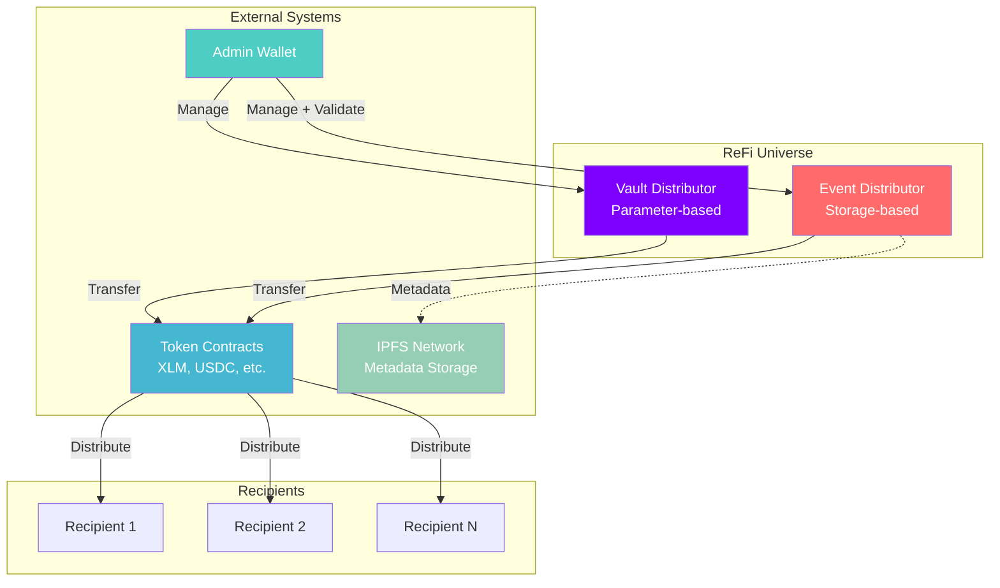
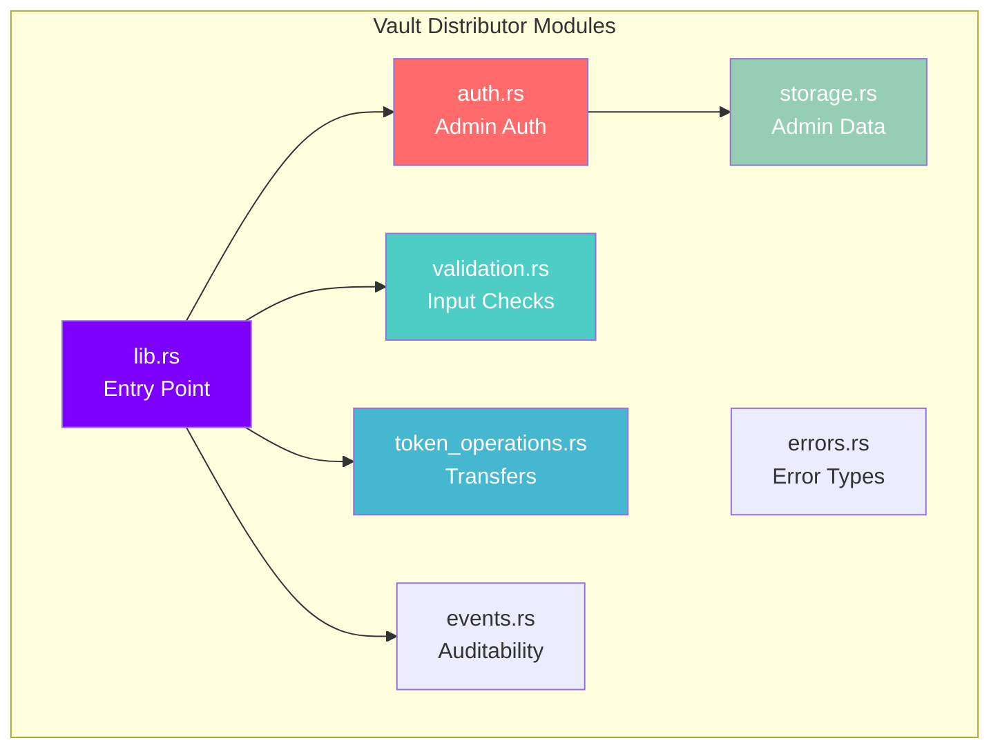
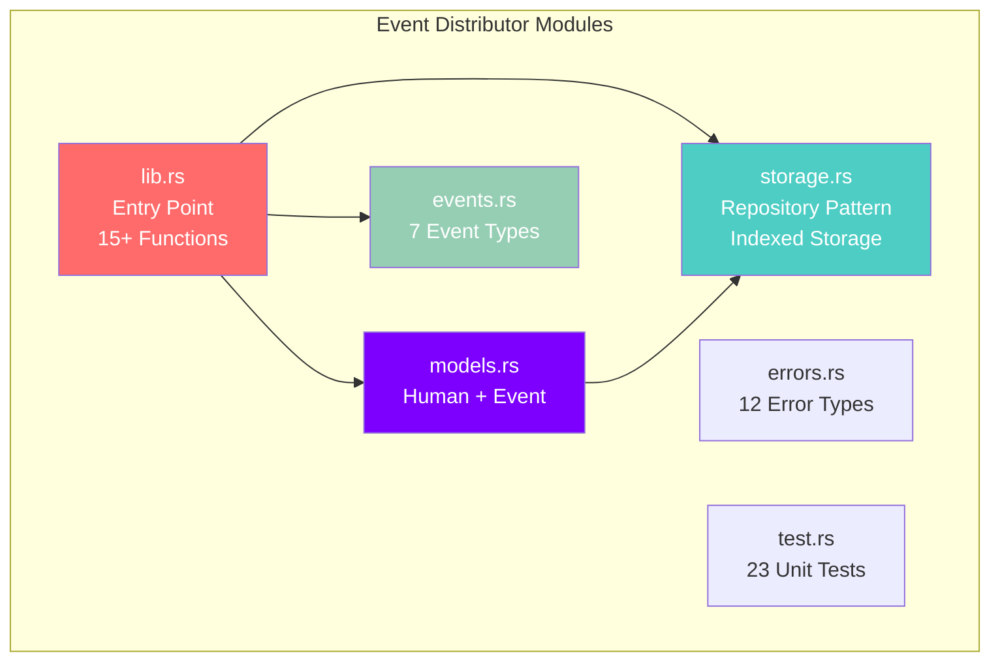
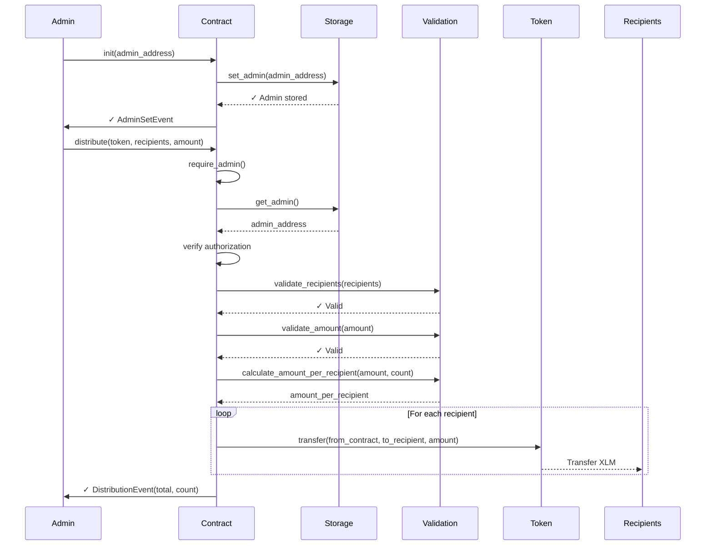
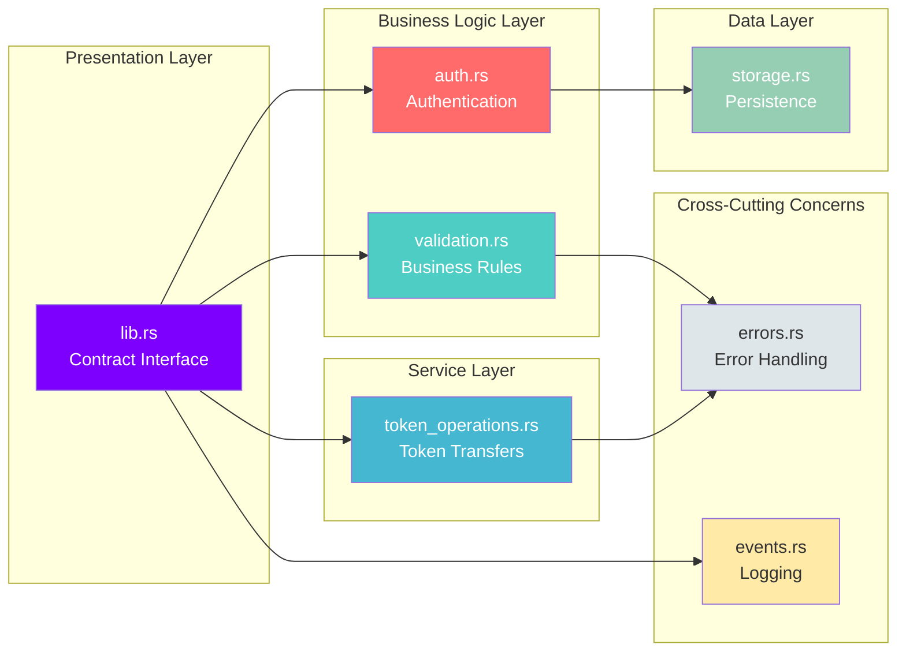

# 🌐 ReFi Universe Smart Contracts

[](https://stellar.org)
[](https://www.rust-lang.org)
[](LICENSE)
[](#-testing)

> Production-ready Stellar Soroban smart contracts suite for regenerative finance: automated fund distribution and validated participant management.

**Vault Distributor on Testnet:** [`CC4XEZG3JIVNTWGNPL4YKIWYECSOTS66SFLIDI3WU6RIJFNDNWPIMVHM`](https://stellar.expert/explorer/testnet/contract/CC4XEZG3JIVNTWGNPL4YKIWYECSOTS66SFLIDI3WU6RIJFNDNWPIMVHM)

---

## 📦 Contracts

This repository contains two complementary smart contracts:

### 🏦 [Vault Distributor](contracts/vault-distributor/README.md)
Simple parameter-based distribution contract for equitable fund allocation.

- ✅ **Parameter-based**: Recipients provided at distribution time
- 💸 **Equitable Division**: Automatic calculation of equal amounts
- 🚀 **Lightweight**: ~15KB WASM, 19 tests
- 🔒 **Admin-controlled**: Secure authorization
- **Use cases**: Payroll, airdrops, rewards, grant distribution

### 🎪 [Event Distributor](contracts/event-distributor/README.md)
Advanced contract with on-chain storage for validated participants and event management.

- 📊 **On-chain Storage**: Persistent participant data with IPFS metadata
- ✅ **Validation System**: Admin-controlled participant validation
- 🎯 **Event Management**: Create events with participant lists
- 🔍 **Smart Filtering**: Automatic distribution to validated participants only
- 📄 **Pagination**: Query large participant lists efficiently
- 🧪 **Tested**: 23 comprehensive tests
- **Use cases**: ReFi events, validated communities, curated distributions

---

## 📑 Table of Contents

- [Contracts](#-contracts)
- [Overview](#-overview)
- [Architecture](#-architecture)
- [Frontend Integration](#-frontend-integration)
- [Quick Start](#-quick-start)
- [Testing](#-testing)
- [Deployment](#-deployment)
- [Documentation](#-documentation)
- [Project Status](#-project-status)
- [License](#-license)

---

## 🚀 Frontend Integration

**New!** Complete integration guide for frontend developers:

📖 **[FRONTEND_README.md](FRONTEND_README.md)** - Quick start (3 steps)  
📚 **[docs/FRONTEND_INTEGRATION.md](docs/FRONTEND_INTEGRATION.md)** - Complete guide with code

**TL;DR:** Frontend sends **imagen Base64 + dirección pública** → Contract stores on Stellar + IPFS

---

## 🎯 Overview

ReFi Universe is a suite of smart contracts built with Rust and Stellar's Soroban SDK for regenerative finance applications. The contracts enable secure, equitable distribution of tokens with different levels of participant management.

Both contracts implement enterprise-grade patterns:

- **SOLID Principles** for maintainable architecture
- **Repository Pattern** for data persistence  
- **Event-Driven** design for auditability
- **Comprehensive Validation** for security
- **100% Test Coverage** for reliability

### Comparison

| Feature | Vault Distributor | Event Distributor |
|---------|-------------------|-------------------|
| **Storage** | Stateless | On-chain participants & events |
| **Recipients** | Provided at call time | Filtered from stored data |
| **Validation** | Off-chain | On-chain validation status |
| **Use Case** | Simple distributions | Event-based with curation |
| **WASM Size** | ~15KB | ~15KB |
| **Tests** | 19 | 23 |

---

## ✨ Key Features

### Shared Features (Both Contracts)
- 🔐 **Admin-Only Operations**: All critical operations require authentication
- ✅ **Input Validation**: Comprehensive parameter checks
- 🛡️ **Overflow Protection**: Safe arithmetic with `checked_div()`
- 💸 **Equitable Distribution**: Automatic equal amount calculation
- 📊 **Event Emission**: Full auditability through events
- ⚡ **Optimized**: Small WASM footprint

### Event Distributor Exclusive
- 📋 **Participant Registry**: On-chain storage with IPFS metadata
- ✅ **Validation System**: Admin-controlled participant approval
- 🎯 **Event Management**: Create events with participant lists
- 🔍 **Smart Filtering**: Only validated participants receive funds
- 📄 **Pagination**: Efficient querying of large datasets

---

## 🏗️ Architecture

### Contracts Ecosystem



### Vault Distributor Architecture



### Event Distributor Architecture



### Contract Flow



### Module Architecture



---

## 🚀 Quick Start

### Prerequisites

- **Rust** >= 1.91.1 ([Install](https://rustup.rs))
- **Stellar CLI** >= 23.2.1 ([Install](https://developers.stellar.org/docs/tools/cli))
- **WebAssembly Target**: `wasm32-unknown-unknown`

### Installation

```bash
# Clone the repository
git clone https://github.com/refiup/sc.git
cd sc

# Install Rust target
rustup target add wasm32-unknown-unknown
```

### Build & Test

#### Vault Distributor
```bash
cd contracts/vault-distributor

# Run tests (19 tests)
cargo test

# Build WASM
cargo build --target wasm32-unknown-unknown --release
```

#### Event Distributor
```bash
cd contracts/event-distributor

# Run tests (23 tests)
cargo test

# Build WASM
cargo build --target wasm32-unknown-unknown --release
```

### All Tests
```bash
# From repository root
cargo test --all

# Expected: 42/42 tests passing
```

---

## 💻 Usage Examples

### Vault Distributor - Simple Distribution

```rust
// Initialize
client.init(&admin);

// Distribute 100 XLM to 3 recipients (33.33 XLM each)
let recipients = vec![&env, recipient1, recipient2, recipient3];
client.distribute(&token, &recipients, &1000000000);
```

### Event Distributor - Validated Distribution

```rust
// Initialize
client.init(&admin);

// Add participants
client.add_human(&human1, &String::from_str(&env, "QmHash1"));
client.add_human(&human2, &String::from_str(&env, "QmHash2"));

// Validate some participants
client.update_human_validation(&human1, &true);

// Create event
client.create_event(
    &String::from_str(&env, "event_001"),
    &String::from_str(&env, "Buenos Aires"),
    &1000000000
);

// Add participants to event
client.add_human_to_event(&String::from_str(&env, "event_001"), &human1);
client.add_human_to_event(&String::from_str(&env, "event_001"), &human2);

// Distribute only to validated participants (human1 only)
client.distribute_event_pool(&String::from_str(&env, "event_001"), &token);
```

**For complete API documentation:**
- [Vault Distributor API](contracts/vault-distributor/README.md#contract-api)
- [Event Distributor API](contracts/event-distributor/README.md#api-reference)

**Parameters:**
- `token`: Token contract address (e.g., XLM native token)
- `recipients`: Vector of recipient addresses
- `total_amount`: Total amount to distribute (in stroops for XLM)

**Emits:** `DistributionEvent`

**Errors:**
- `Unauthorized` (3): Caller is not admin
- `EmptyRecipients` (4): Recipients list is empty
- `InvalidAmount` (5): Amount is zero or negative
- `ZeroAmountPerRecipient` (6): Amount too small for distribution
- `MathError` (7): Arithmetic overflow

**Calculation:**
```rust
amount_per_recipient = total_amount / recipients.len()
```

---

## 🧪 Testing

### Test Coverage: 42/42 Tests Passing ✓

```bash
# Run all tests (both contracts)
cargo test --all

# Test individual contracts
cd contracts/vault-distributor && cargo test     # 19 tests
cd contracts/event-distributor && cargo test     # 23 tests
```

### Vault Distributor Tests (19)

**Coverage:**
- Initialization (2 tests)
- Distribution logic (6 tests)
- Authorization (4 tests)
- Amount calculations (7 tests)

**Key Scenarios:**
- ✅ Equitable distribution with remainders
- ✅ Large recipient lists (100+)
- ✅ Maximum amount handling (i128::MAX)
- ✅ Zero/negative amount rejection
- ✅ Unauthorized access prevention

### Event Distributor Tests (23)

**Coverage:**
- Initialization (3 tests)
- Human management (7 tests)
- Event management (7 tests)
- Distribution with validation (6 tests)

**Key Scenarios:**
- ✅ On-chain participant storage with IPFS
- ✅ Validation status management
- ✅ Event creation with participant lists
- ✅ Filtering validated participants
- ✅ Pagination for large datasets
- ✅ Distribution to validated humans only

See [docs/TESTING.md](docs/TESTING.md) for detailed test reports.

---

## 🚢 Deployment

### Testnet Deployment

```bash
# Use automated deployment script
./deploy.sh

# Or manual deployment
cd contracts/vault-distributor
cargo build --target wasm32v1-none --release

stellar contract deploy \
  --wasm target/wasm32v1-none/release/vault_distributor.wasm \
  --source admin \
  --network testnet
```

### Mainnet Deployment

⚠️ **Security Audit Required** before mainnet deployment.

```bash
# Deploy to mainnet (after audit)
stellar contract deploy \
  --wasm target/wasm32v1-none/release/vault_distributor.wasm \
  --source admin \
  --network mainnet
```

See [docs/DEPLOYMENT.md](docs/DEPLOYMENT.md) for complete deployment guide.

---

## 📚 Documentation

Comprehensive documentation available in the `docs/` directory:

| Document | Description |
|----------|-------------|
| [ARCHITECTURE.md](docs/ARCHITECTURE.md) | SOLID principles, design patterns, and module documentation |
| [DEPLOYMENT.md](docs/DEPLOYMENT.md) | Step-by-step deployment guide for testnet and mainnet |
| [INTEGRATION.md](docs/INTEGRATION.md) | Frontend integration guide with React + Freighter examples |
| [TESTING.md](docs/TESTING.md) | Complete test coverage report with all 19 tests documented |
| [CHANGELOG.md](docs/CHANGELOG.md) | Version history and release notes |
| [BACKLOG.md](docs/BACKLOG.md) | Use cases and requirements tracking (11/11 complete) |
| [COMPLETION.md](docs/COMPLETION.md) | Project completion summary and metrics |
| [SUBMISSION.md](docs/SUBMISSION.md) | EthGlobal BA 2025 submission checklist |

---

## 📊 Project Status

### Current Version: `1.0.0`

✅ **Production Ready** for Testnet

### Metrics

| Metric | Vault Distributor | Event Distributor | Total |
|--------|------------------|-------------------|-------|
| **Code Lines** | ~1,300 | ~1,500 | ~2,800 |
| **Modules** | 7 | 6 | 13 |
| **Tests** | 19 | 23 | 42 |
| **Test Pass Rate** | 100% | 100% | 100% |
| **WASM Size** | ~15KB | ~15KB | ~30KB |
| **Functions** | 3 | 11 | 14 |
| **Errors** | 5 | 12 | 17 |
| **Events** | 2 | 7 | 9 |

### Live Contracts

#### Vault Distributor
**Network:** Stellar Testnet  
**Contract ID:** `CC4XEZG3JIVNTWGNPL4YKIWYECSOTS66SFLIDI3WU6RIJFNDNWPIMVHM`  
**Explorer:** [View on Stellar Expert](https://stellar.expert/explorer/testnet/contract/CC4XEZG3JIVNTWGNPL4YKIWYECSOTS66SFLIDI3WU6RIJFNDNWPIMVHM)  
**Status:** ✅ Active & Tested  
**Transactions:** 197+ XLM distributed

#### Event Distributor
**Network:** Stellar Testnet  
**Contract ID:** `CCHFGFX3S52UX46HZEBEGW5N2LDDYMSJDLZF4CQOZ6TSWWKFEG4TFPLS`  
**Explorer:** [View on Stellar Expert](https://stellar.expert/explorer/testnet/contract/CCHFGFX3S52UX46HZEBEGW5N2LDDYMSJDLZF4CQOZ6TSWWKFEG4TFPLS)  
**Status:** ✅ Deployed & Initialized  
**Tests:** 23/23 passing

### Technology Stack

```yaml
Language: Rust 1.91.1
Framework: Soroban SDK v23
Blockchain: Stellar (Soroban)
Target: WebAssembly (wasm32-unknown-unknown)
Tools:
  - Stellar CLI v23.2.1
  - Cargo (Rust package manager)
  - Git (version control)
Storage: Persistent on-chain (Event Distributor)
Testing: Native Rust tests (cargo test)
Documentation: 8 comprehensive markdown files
```

---

## 📜 License

This project is licensed under the **MIT License** - see the [LICENSE](LICENSE) file for details.

---

## 🎓 About

### Project Information

**Project:** ReFi Universe - Smart Contracts Suite  
**Event:** EthGlobal Buenos Aires 2025  
**Category:** Regenerative Finance (ReFi)  
**Blockchain:** Stellar (Soroban)

### Contracts

1. **Vault Distributor** - Simple parameter-based distribution
2. **Event Distributor** - Advanced validated participant management

### Organization

**Organization:** RefiUp  
**Repository:** [github.com/refiup/sc](https://github.com/refiup/sc)

### Acknowledgments

- [Stellar Development Foundation](https://stellar.org) for the Soroban platform
- [Rust Community](https://www.rust-lang.org/community) for excellent tooling
- [EthGlobal](https://ethglobal.com) for organizing the hackathon

---

## 🔗 Links

- **Repository:** [github.com/refiup/sc](https://github.com/refiup/sc)
- **Vault Distributor Explorer:** [Stellar Expert](https://stellar.expert/explorer/testnet/contract/CC4XEZG3JIVNTWGNPL4YKIWYECSOTS66SFLIDI3WU6RIJFNDNWPIMVHM)
- **Stellar Docs:** [developers.stellar.org](https://developers.stellar.org)
- **Soroban SDK:** [docs.rs/soroban-sdk](https://docs.rs/soroban-sdk)

---

<div align="center">

**Built with ❤️ for the Stellar ecosystem**

[Report Bug](https://github.com/DevCristobalvc/refi-universe-sc/issues) · [Request Feature](https://github.com/DevCristobalvc/refi-universe-sc/issues) · [Documentation](docs/)

</div>
