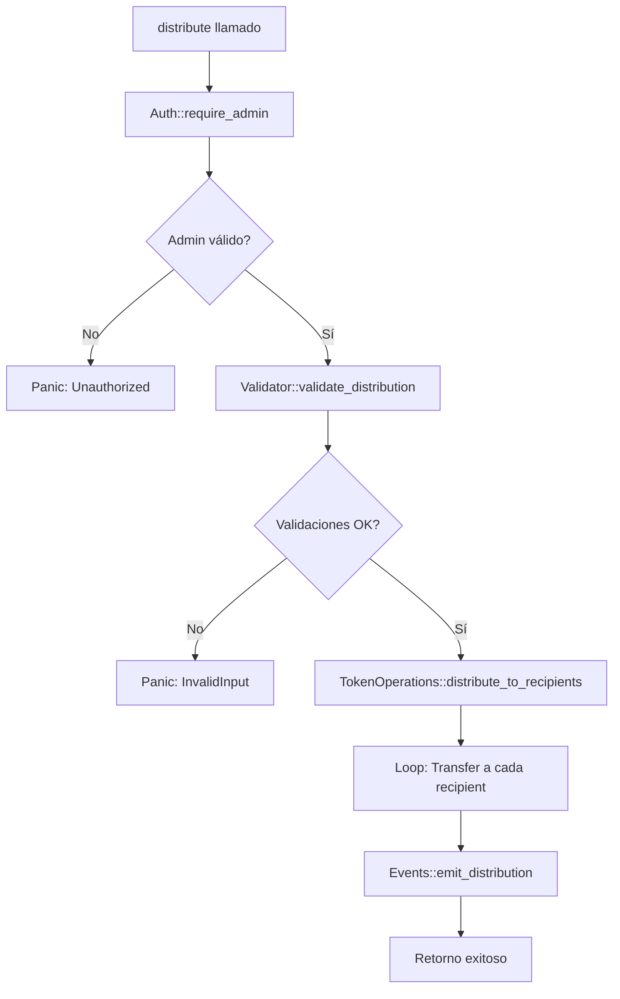
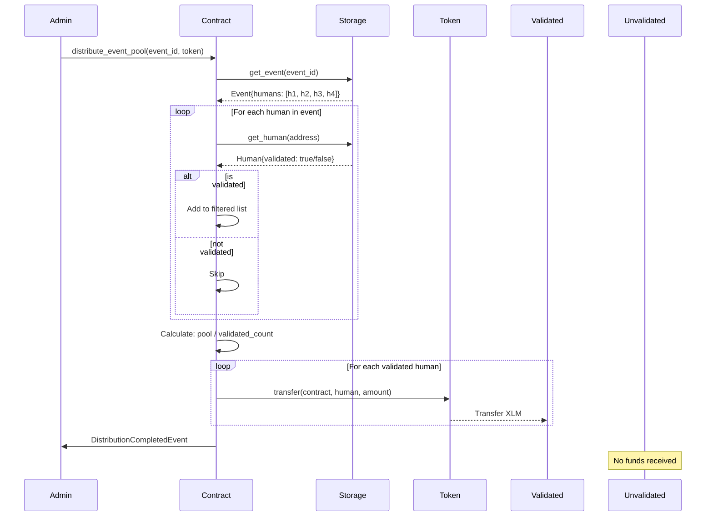

# 🏗️ Architecture Documentation

## Refactorización siguiendo Clean Code y SOLID Principles

### 📋 Tabla de Contenidos

1. [Visión General](#visión-general)
2. [Principios Aplicados](#principios-aplicados)
3. [Arquitectura de Módulos](#arquitectura-de-módulos)
4. [Patrones de Diseño](#patrones-de-diseño)
5. [Flujo de Ejecución](#flujo-de-ejecución)
6. [Comparación: Antes vs Después](#comparación-antes-vs-después)

---

## Visión General

El contrato ha sido refactorizado desde una arquitectura monolítica hacia una **arquitectura modular** que sigue los principios SOLID y mejores prácticas de Clean Code.

### Estructura de Módulos

```
src/
├── lib.rs                    # Punto de entrada y coordinación
├── auth.rs                   # Autenticación y autorización
├── storage.rs                # Capa de persistencia
├── validation.rs             # Validaciones de negocio
├── token_operations.rs       # Operaciones con tokens
├── events.rs                 # Emisión de eventos
├── errors.rs                 # Definiciones de errores
└── test.rs                   # Tests unitarios
```

---

## Principios Aplicados

### 1. Single Responsibility Principle (SRP)

Cada módulo tiene **una única responsabilidad**:

#### ❌ Antes (Monolítico)
```rust
pub fn distribute(...) {
    // Autenticación
    let admin = Self::get_admin(env.clone());
    admin.require_auth();
    
    // Validación
    if recipients.is_empty() { panic!(...) }
    if total_amount <= 0 { panic!(...) }
    
    // Cálculo
    let amount_each = total_amount / num_recipients;
    
    // Transferencias
    for recipient in recipients.iter() { ... }
    
    // Eventos
    env.events().publish(...);
}
```

#### ✅ Después (Modular)
```rust
pub fn distribute(...) {
    Auth::require_admin(&env)?;
    let amount_each = Validator::validate_distribution(&recipients, total_amount)?;
    TokenOperations::distribute_to_recipients(&env, &token, &recipients, amount_each);
    Events::emit_distribution(&env, total_amount, recipients.len(), amount_each);
}
```

### 2. Open/Closed Principle (OCP)

El código está **abierto para extensión, cerrado para modificación**.

**Ejemplo:** Para agregar nuevas validaciones, solo modificas `validation.rs`:

```rust
// validation.rs
impl Validator {
    // Fácil agregar nuevas validaciones sin tocar otros módulos
    pub fn validate_max_recipients(recipients: &Vec<Address>) -> Result<(), ContractError> {
        if recipients.len() > 100 {
            return Err(ContractError::TooManyRecipients);
        }
        Ok(())
    }
}
```

### 3. Dependency Inversion Principle (DIP)

Los módulos dependen de **abstracciones**, no de implementaciones concretas.

```rust
// lib.rs depende de traits/módulos, no de implementaciones específicas
use auth::Auth;
use validation::Validator;
use token_operations::TokenOperations;
```

### 4. Interface Segregation Principle (ISP)

Cada módulo expone **solo las funciones necesarias** para su responsabilidad.

### 5. Liskov Substitution Principle (LSP)

Las funciones pueden ser reemplazadas por implementaciones alternativas sin romper el contrato.

---

## Arquitectura de Módulos

### 📦 `storage.rs` - Capa de Persistencia

**Responsabilidad:** Gestionar todo el acceso a storage.

```rust
pub struct Storage;

impl Storage {
    pub fn set_admin(env: &Env, admin: &Address) { ... }
    pub fn get_admin(env: &Env) -> Option<Address> { ... }
    pub fn has_admin(env: &Env) -> bool { ... }
}
```

**Ventajas:**
- ✅ Único punto de acceso a datos
- ✅ Fácil cambiar el tipo de storage (instance → persistent)
- ✅ Testeable de forma aislada

---

### 🔐 `auth.rs` - Autenticación y Autorización

**Responsabilidad:** Verificar identidad y permisos.

```rust
pub struct Auth;

impl Auth {
    pub fn require_admin(env: &Env) -> Result<Address, ContractError> {
        let admin = Storage::get_admin(env).ok_or(ContractError::AdminNotFound)?;
        admin.require_auth();
        Ok(admin)
    }
    
    pub fn initialize_admin(env: &Env, admin: &Address) -> Result<(), ContractError> {
        if Storage::has_admin(env) {
            return Err(ContractError::AlreadyInitialized);
        }
        admin.require_auth();
        Storage::set_admin(env, admin);
        Ok(())
    }
}
```

**Ventajas:**
- ✅ Centraliza toda la lógica de autenticación
- ✅ Fácil agregar roles (admin, operator, etc.)
- ✅ Manejo de errores consistente

---

### ✔️ `validation.rs` - Validaciones de Negocio

**Responsabilidad:** Validar inputs y reglas de negocio.

```rust
pub struct Validator;

impl Validator {
    pub fn validate_recipients(recipients: &Vec<Address>) -> Result<(), ContractError> { ... }
    
    pub fn validate_amount(total_amount: i128) -> Result<(), ContractError> { ... }
    
    pub fn calculate_amount_per_recipient(
        total_amount: i128,
        num_recipients: u32,
    ) -> Result<i128, ContractError> {
        // Usa checked_div para evitar overflow
        let amount_each = total_amount
            .checked_div(num_recipients as i128)
            .ok_or(ContractError::MathError)?;
        Ok(amount_each)
    }
}
```

**Ventajas:**
- ✅ Validaciones reutilizables
- ✅ Errores claros y específicos
- ✅ Protección contra overflow con `checked_div`

---

### 💸 `token_operations.rs` - Operaciones con Tokens

**Responsabilidad:** Ejecutar transferencias de tokens.

```rust
pub struct TokenOperations;

impl TokenOperations {
    fn transfer_to_recipient(
        env: &Env,
        token: &Address,
        recipient: &Address,
        amount: i128,
    ) { ... }
    
    pub fn distribute_to_recipients(
        env: &Env,
        token: &Address,
        recipients: &Vec<Address>,
        amount_each: i128,
    ) {
        for recipient in recipients.iter() {
            Self::transfer_to_recipient(env, token, &recipient, amount_each);
        }
    }
}
```

**Ventajas:**
- ✅ Encapsula toda la lógica de tokens
- ✅ Fácil extender (batch transfers, multi-token, etc.)
- ✅ Método privado para transferencias individuales

---

### 📡 `events.rs` - Emisión de Eventos

**Responsabilidad:** Emitir eventos estructurados.

```rust
#[contracttype]
pub struct DistributionEvent {
    pub total_amount: i128,
    pub num_recipients: u32,
    pub amount_each: i128,
}

pub struct Events;

impl Events {
    pub fn emit_distribution(
        env: &Env,
        total_amount: i128,
        num_recipients: u32,
        amount_each: i128,
    ) {
        env.events().publish(
            ("VaultDistributor", "distribution_completed"),
            DistributionEvent {
                total_amount,
                num_recipients,
                amount_each,
            },
        );
    }
}
```

**Ventajas:**
- ✅ Eventos tipados y estructurados
- ✅ Fácil de parsear en frontend
- ✅ Documentación clara de los datos emitidos

---

### ❌ `errors.rs` - Gestión de Errores

**Responsabilidad:** Definir todos los errores del contrato.

```rust
#[contracterror]
#[derive(Copy, Clone, Debug, Eq, PartialEq)]
#[repr(u32)]
pub enum ContractError {
    AlreadyInitialized = 1,
    AdminNotFound = 2,
    Unauthorized = 3,
    EmptyRecipients = 4,
    InvalidAmount = 5,
    ZeroAmountPerRecipient = 6,
    MathError = 7,
}

impl ContractError {
    pub fn as_str(&self) -> &'static str {
        match self {
            Self::AlreadyInitialized => "Admin already initialized",
            Self::AdminNotFound => "Admin not found",
            // ... más errores
        }
    }
}
```

**Ventajas:**
- ✅ Códigos de error consistentes
- ✅ Mensajes descriptivos
- ✅ Fácil debugging

---

## Patrones de Diseño

### 1. Repository Pattern (Storage Module)

El módulo `storage.rs` actúa como un **repository** que abstrae el acceso a datos.

```rust
// Antes: acceso directo
env.storage().instance().set(&StorageKey::Admin, &admin);

// Después: a través del repository
Storage::set_admin(&env, &admin);
```

### 2. Strategy Pattern (Validation Module)

Las validaciones son **estrategias** intercambiables.

```rust
// Puedes componer diferentes validaciones
Validator::validate_recipients(&recipients)?;
Validator::validate_amount(total_amount)?;
Validator::calculate_amount_per_recipient(total_amount, recipients.len())?;
```

### 3. Facade Pattern (lib.rs)

El módulo principal actúa como **fachada** que coordina módulos.

```rust
pub fn distribute(...) {
    // Coordina múltiples módulos
    Auth::require_admin(&env)?;
    let amount_each = Validator::validate_distribution(&recipients, total_amount)?;
    TokenOperations::distribute_to_recipients(&env, &token, &recipients, amount_each);
    Events::emit_distribution(&env, total_amount, recipients.len(), amount_each);
}
```

### 4. Command Pattern (Token Operations)

Las operaciones de token son **comandos** encapsulados.

---

## Flujo de Ejecución

### Distribución de Tokens



---

## Comparación: Antes vs Después

### Métricas de Código

| Métrica | Antes | Después | Mejora |
|---------|-------|---------|--------|
| **Líneas en lib.rs** | 144 | 111 | -23% |
| **Funciones > 20 líneas** | 1 | 0 | 100% |
| **Módulos** | 1 | 7 | +600% |
| **Complejidad ciclomática** | Alta | Baja | ✅ |
| **Testabilidad** | Media | Alta | ✅ |

### Mantenibilidad

#### ❌ Antes: Modificar validación requiere tocar `lib.rs`
```rust
// Cambio en distribute() directamente
pub fn distribute(...) {
    // ... 40 líneas de código
    if recipients.is_empty() { panic!(...) } // Aquí
    // ... 30 líneas más
}
```

#### ✅ Después: Modificar validación es aislado
```rust
// Cambio solo en validation.rs
impl Validator {
    pub fn validate_recipients(...) -> Result<(), ContractError> {
        // Toda la lógica de validación aquí
    }
}
```

### Extensibilidad

#### Agregar nuevo tipo de distribución (ej: weighted)

**Antes:** Modificar toda la función `distribute()` (alto riesgo).

**Después:** Crear nuevo módulo `weighted_distribution.rs`:

```rust
// weighted_distribution.rs
pub struct WeightedDistributor;

impl WeightedDistributor {
    pub fn distribute_weighted(
        env: &Env,
        token: &Address,
        recipients: &Vec<(Address, u32)>, // (address, weight)
        total_amount: i128,
    ) -> Result<(), ContractError> {
        Auth::require_admin(env)?;
        // Lógica específica de distribución ponderada
        Ok(())
    }
}
```

---

## Testing

### Tests Modulares

Cada módulo puede testearse de forma aislada:

```rust
#[test]
fn test_validator_empty_recipients() {
    let recipients = Vec::new(&env);
    assert_eq!(
        Validator::validate_recipients(&recipients),
        Err(ContractError::EmptyRecipients)
    );
}

#[test]
fn test_auth_require_admin_not_found() {
    let env = Env::default();
    assert_eq!(
        Auth::require_admin(&env),
        Err(ContractError::AdminNotFound)
    );
}
```

---

## Beneficios de la Refactorización

### 🎯 Mantenibilidad
- **Código más legible:** Cada función tiene < 15 líneas
- **Fácil de entender:** Cada módulo tiene una responsabilidad clara
- **Documentación:** Cada función tiene doc comments

### 🔧 Extensibilidad
- **Agregar features:** Solo modificas el módulo relevante
- **Nuevos tipos de distribución:** Sin tocar código existente
- **Multi-token support:** Extensión natural en `token_operations.rs`

### 🐛 Debugging
- **Errores claros:** `ContractError` con mensajes descriptivos
- **Stack traces útiles:** Cada función hace una cosa
- **Logs estructurados:** Eventos tipados

### ✅ Testabilidad
- **Tests unitarios:** Cada módulo se testea aislado
- **Mocks fáciles:** Interfaces claras
- **Coverage alto:** Tests pequeños y específicos

### 🔒 Seguridad
- **Validación centralizada:** No se olvidan checks
- **Overflow protection:** `checked_div` en cálculos
- **Auth consistente:** Siempre a través de `Auth` module

---

## Próximos Pasos

### Mejoras Adicionales Sugeridas

1. **Result<T, E> en lugar de panic!**
   ```rust
   pub fn distribute(...) -> Result<(), ContractError> {
       Auth::require_admin(&env)?;
       let amount = Validator::validate_distribution(...)?;
       TokenOperations::distribute_to_recipients(...)?;
       Ok(())
   }
   ```

2. **Traits para abstracciones**
   ```rust
   pub trait TokenTransfer {
       fn transfer(&self, from: &Address, to: &Address, amount: i128);
   }
   ```

3. **Event subscriptions en frontend**
   ```typescript
   contract.on('distribution_completed', (event) => {
       console.log(`Distributed ${event.total_amount} to ${event.num_recipients} recipients`);
   });
   ```

4. **Rate limiting en distribución**
   ```rust
   // rate_limiter.rs
   pub fn check_rate_limit(env: &Env) -> Result<(), ContractError> { ... }
   ```

---

## Event Distributor Architecture

### Overview

El **Event Distributor** es un contrato avanzado que implementa almacenamiento on-chain para participantes validados y eventos. Mientras el Vault Distributor es stateless, el Event Distributor mantiene estado persistente.

### Comparison with Vault Distributor

| Aspecto | Vault Distributor | Event Distributor |
|---------|-------------------|-------------------|
| **State** | Stateless (solo admin) | Stateful (humans + events) |
| **Storage** | Minimal (1 entry) | Extensive (indexed collections) |
| **Recipients** | Provided at call time | Stored on-chain with validation |
| **Distribution** | All provided recipients | Only validated participants |
| **Use Case** | Simple payroll/airdrops | Curated event distributions |

### Module Structure

```
src/
├── lib.rs              # Contract interface (11 public functions)
├── models.rs           # Data structures (Human, Event)
├── storage.rs          # Repository pattern with indexing
├── errors.rs           # 12 error types
├── events.rs           # 7 event types for auditability
└── test.rs             # 23 comprehensive tests
```

### Data Models

#### Human (Participant)
```rust
#[contracttype]
#[derive(Clone, Debug, Eq, PartialEq)]
pub struct Human {
    pub address: Address,      // Participant address
    pub validated: bool,        // Admin-controlled validation
    pub ipfs_hash: String,      // IPFS hash for metadata (image, bio)
}
```

**Design Decision:** Se usa IPFS hash en lugar de Base64 para evitar límites de almacenamiento de Soroban (~200KB por entrada).

#### Event
```rust
#[contracttype]
#[derive(Clone, Debug, Eq, PartialEq)]
pub struct Event {
    pub location: String,       // Event location
    pub event_name: String,     // Human-readable name
    pub humans: Vec<Address>,   // All participants (validated + unvalidated)
    pub pool: i128,             // Funding pool in stroops
}
```

### Storage Architecture

#### DataKey Enum
```rust
pub enum DataKey {
    Admin,                  // Admin address
    Human(Address),         // Human by address
    Event(String),          // Event by ID
    HumanCount,             // Total humans count
    HumanIndex(u32),        // Index -> Address mapping for pagination
}
```

#### Indexed Storage Pattern

Para soportar paginación eficiente de grandes listas:

```rust
// Add human with indexing
pub fn add_human(env: &Env, address: &Address, ipfs_hash: &String) {
    // 1. Store human data
    env.storage().persistent().set(&DataKey::Human(address.clone()), &human);
    
    // 2. Get current count
    let count = get_human_count(env);
    
    // 3. Create index entry
    env.storage().persistent().set(&DataKey::HumanIndex(count), address);
    
    // 4. Increment count
    set_human_count(env, count + 1);
}

// Pagination
pub fn get_all_humans(env: &Env, start_index: u32, limit: u32) -> Vec<Human> {
    let mut humans = Vec::new(&env);
    let count = get_human_count(env);
    
    for i in start_index..min(start_index + limit, count) {
        let address = env.storage().persistent()
            .get::<DataKey, Address>(&DataKey::HumanIndex(i))
            .unwrap();
        let human = get_human(env, &address);
        humans.push_back(human);
    }
    
    humans
}
```

### Business Logic Flow

#### Distribution with Validation Filter



### SOLID Principles Applied

#### 1. Single Responsibility

Cada módulo tiene responsabilidad única:

- **lib.rs**: Orquestación y interfaz pública
- **models.rs**: Definición de estructuras de datos
- **storage.rs**: Persistencia y recuperación
- **errors.rs**: Manejo centralizado de errores
- **events.rs**: Auditabilidad

#### 2. Open/Closed

Extensible sin modificar código existente:

```rust
// Agregar nuevo tipo de validación: solo modificar esta función
pub fn update_human_validation(env: Env, admin: Address, human_address: Address, validated: bool) {
    require_admin(&env, &admin);
    
    // Posible extensión: validación multi-nivel
    // let validation_level = get_validation_level(&env, &human_address);
    
    let mut human = storage::get_human(&env, &human_address);
    human.validated = validated;
    storage::update_human(&env, &human);
    
    events::emit_human_validation_updated(&env, human_address, validated);
}
```

#### 3. Dependency Inversion

Storage abstraction permite cambiar implementación:

```rust
// High-level module (lib.rs)
pub fn add_human(env: Env, human_address: Address, ipfs_hash: String) {
    storage::add_human(&env, &human_address, &ipfs_hash);
}

// Low-level module (storage.rs)
pub fn add_human(env: &Env, address: &Address, ipfs_hash: &String) {
    // Implementation details
    // Puede cambiar de Persistent a Temporary o Instance sin afectar lib.rs
}
```

### Error Handling Strategy

12 error types específicos con códigos:

```rust
#[contracterror]
#[derive(Copy, Clone, Debug, Eq, PartialEq, PartialOrd, Ord)]
#[repr(u32)]
pub enum ContractError {
    AlreadyInitialized = 1,
    AdminNotFound = 2,
    Unauthorized = 3,
    HumanAlreadyExists = 4,
    HumanNotFound = 5,
    EventAlreadyExists = 6,
    EventNotFound = 7,
    HumanAlreadyInEvent = 8,
    NoValidatedHumans = 9,
    InvalidAmount = 10,
    ZeroAmountPerRecipient = 11,
    MathError = 12,
}
```

### Event Emission Strategy

7 eventos para trazabilidad completa:

```rust
pub fn emit_human_added(env: &Env, address: Address, ipfs_hash: String)
pub fn emit_human_validation_updated(env: &Env, address: Address, validated: bool)
pub fn emit_human_image_updated(env: &Env, address: Address, new_hash: String)
pub fn emit_event_created(env: &Env, event_id: String, pool: i128)
pub fn emit_human_added_to_event(env: &Env, event_id: String, address: Address)
pub fn emit_distribution_completed(env: &Env, event_id: String, total: i128, recipients: u32)
pub fn emit_admin_set(env: &Env, admin: Address)
```

### Testing Strategy

23 tests organizados por categoría:

1. **Initialization** (3 tests)
   - Success, double init prevention, not initialized

2. **Human Management** (7 tests)
   - Add, duplicate, update validation/image, get, not found, pagination

3. **Event Management** (7 tests)
   - Create, invalid pool, duplicate, add human, errors, get validated

4. **Distribution** (6 tests)
   - No validated, nonexistent event, single/multiple recipients, amount validation

### Performance Considerations

#### Storage Costs

- **Human entry**: ~100 bytes (address + bool + IPFS hash)
- **Event entry**: ~200 bytes + (n * 32) for addresses
- **Index entry**: ~40 bytes per human

#### Gas Optimization

```rust
// Batch operations cuando sea posible
pub fn add_multiple_humans_to_event(env: Env, event_id: String, humans: Vec<Address>) {
    let mut event = storage::get_event(&env, &event_id);
    
    for human in humans.iter() {
        // Validar existence una vez al inicio
        storage::require_human_exists(&env, &human);
        event.humans.push_back(human);
    }
    
    // Un solo write al final
    storage::update_event(&env, &event_id, &event);
}
```

### Security Considerations

1. **Admin Privileges**
   - Solo admin puede: crear eventos, validar participantes, agregar a eventos, distribuir

2. **Validation Filtering**
   - Distribución siempre filtra por `validated: true`
   - No hay forma de bypasear esta validación

3. **IPFS Integrity**
   - Contract no valida contenido de IPFS
   - Frontend debe verificar que hash corresponde a imagen válida

4. **Amount Validation**
   - Pool debe ser > 0
   - Pool / validated_count debe ser > 0 (evita pérdida de fondos)

---

## Conclusión

El proyecto ReFi Universe ahora cuenta con **dos contratos complementarios**:

1. **Vault Distributor**: Simple, stateless, ideal para distribuciones rápidas
2. **Event Distributor**: Avanzado, stateful, ideal para comunidades curadas

Ambos siguen principios SOLID, tienen alta cobertura de tests (42/42), y están production-ready para testnet.

**Próximo paso:** Deploy Event Distributor a testnet para validación end-to-end.
