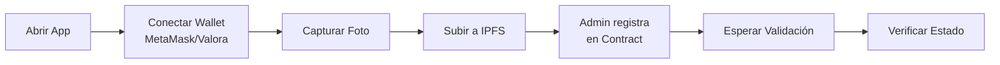
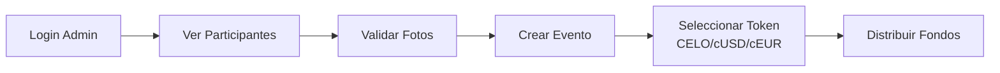

# 🎨 UI Integration Guides - Celo

Guías completas para integrar el frontend con los smart contracts de ReFi Universe desplegados en **Celo**.

---

## 📚 Guías Disponibles

### 📱 [GUIDE_INTEGRATION_APP.md](GUIDE_INTEGRATION_APP.md)
**Para: App de Usuario (Participantes)**

Flujo completo para que los usuarios:
- 📸 Capturen su foto (cámara o upload)
- 📤 Suban imagen a IPFS
- 🔗 Conecten su wallet (MetaMask/Valora)
- ✅ Se registren en el contrato
- 🔍 Verifiquen su estado de validación

**Stack:**
- React + ethers.js/wagmi
- Celo network (Alfajores testnet)
- IPFS para almacenamiento de imágenes
- MetaMask o Valora wallet

---

### 👨‍⚖️ [GUIDE_INTEGRATION_JUDGE.md](GUIDE_INTEGRATION_JUDGE.md)
**Para: App del Juez (Administrador)**

Dashboard completo para que el juez:
- 👥 Vea galería de participantes
- ✅ Valide o rechace fotos
- 🎪 Cree eventos
- 💰 Distribuya fondos (CELO, cUSD, cEUR)
- 📊 Monitoree estadísticas

**Stack:**
- React + ethers.js/wagmi
- Admin dashboard
- Multi-token support (CELO, cUSD, cEUR, cREAL)

---

## 🌐 Diferencias con Stellar

| Aspecto | Stellar (Soroban) | Celo (EVM) |
|---------|-------------------|------------|
| **Wallet** | Freighter | MetaMask/Valora |
| **SDK** | @stellar/stellar-sdk | ethers.js/viem/wagmi |
| **Gas** | Stroops (XLM) | Wei (CELO) |
| **Tokens** | Stellar assets | ERC20 (cUSD, cEUR, etc.) |
| **Network ID** | "testnet" | Chain ID: 44787 |
| **Explorer** | stellar.expert | celoscan.io |

---

## 🚀 Quick Start

### 1. Instalación
```bash
npm install ethers wagmi viem @tanstack/react-query
```

### 2. Variables de Entorno
```env
# .env.local
REACT_APP_NETWORK=alfajores
REACT_APP_CHAIN_ID=44787
REACT_APP_RPC_URL=https://alfajores-forno.celo-testnet.org

# Contract Address (después de deployment)
REACT_APP_EVENT_DISTRIBUTOR=0x...

# IPFS
REACT_APP_PINATA_API_KEY=tu_api_key
REACT_APP_PINATA_SECRET_KEY=tu_secret_key
```

### 3. Add Celo to MetaMask

**Alfajores Testnet:**
```
Network Name: Celo Alfajores
RPC URL: https://alfajores-forno.celo-testnet.org
Chain ID: 44787
Currency: CELO
Explorer: https://alfajores.celoscan.io
```

### 4. Get Testnet Tokens

**Faucet:** https://faucet.celo.org/alfajores
- Get CELO for gas
- Get cUSD for testing distributions

---

## 📊 Contract Functions

### Para Usuarios
| Función | Descripción | Gas Estimado |
|---------|-------------|--------------|
| `getHuman(address)` | Ver info | Read-only |
| `getAllHumans(start, limit)` | Lista paginada | Read-only |

### Para Admin
| Función | Descripción | Gas Estimado |
|---------|-------------|--------------|
| `addHuman(addr, ipfs)` | Agregar participante | ~100k gas |
| `updateHumanValidation(addr, bool)` | Validar | ~50k gas |
| `updateHumanImage(addr, ipfs)` | Cambiar imagen | ~45k gas |
| `createEvent(name, addrs[])` | Crear evento | ~150k + 20k per addr |
| `distributeToEvent(id, token, amount)` | Distribuir | ~50k per recipient |

**Gas Price:** ~0.5 Gwei (muy bajo en Celo)  
**Costos:** ~$0.001 - $0.01 USD por transacción

---

## 🎯 Flujos de Usuario

### Usuario (Participante)


### Juez (Admin)


---

## 💰 Tokens Soportados

### Celo Native
```javascript
// Distribuir CELO nativo
const token = '0x0000000000000000000000000000000000000000'; // address(0)
await distributeToEvent(eventId, token, amountInWei);
```

### cUSD (Celo Dollar)
```javascript
// Alfajores cUSD
const cUSD = '0x874069Fa1Eb16D44d622F2e0Ca25eeA172369bC1';
await distributeToEvent(eventId, cUSD, amountInWei);
```

### cEUR (Celo Euro)
```javascript
// Alfajores cEUR
const cEUR = '0x10c892A6EC43a53E45D0B916B4b7D383B1b78C0F';
await distributeToEvent(eventId, cEUR, amountInWei);
```

### cREAL (Celo Real)
```javascript
// Alfajores cREAL
const cREAL = '0xE4D517785D091D3c54818832dB6094bcc2744545';
await distributeToEvent(eventId, cREAL, amountInWei);
```

---

## 🛠️ Stack Tecnológico

### Wagmi (Recomendado)
```javascript
import { useAccount, useContractWrite } from 'wagmi';

const { address } = useAccount();

const { write } = useContractWrite({
  address: CONTRACT_ADDRESS,
  abi: ABI,
  functionName: 'addHuman'
});
```

### ethers.js (Alternativa)
```javascript
import { ethers } from 'ethers';

const provider = new ethers.BrowserProvider(window.ethereum);
const signer = await provider.getSigner();
const contract = new ethers.Contract(address, abi, signer);
```

---

## 📱 Soporte Mobile

### Valora Wallet
- Wallet nativa de Celo
- WalletConnect integrado
- Fácil onboarding
- Soporte para cUSD, cEUR, cREAL

### MetaMask Mobile
- Compatible con Celo
- Necesita configuración manual de red
- WalletConnect

---

## 🔧 Testing

### Test de Usuario
```javascript
// 1. Conectar wallet
const accounts = await window.ethereum.request({ 
  method: 'eth_requestAccounts' 
});

// 2. Subir imagen a IPFS
const ipfsHash = await uploadToIPFS(imageBase64);

// 3. El admin registra al usuario
// (En producción, esto sería automático o vía backend)

// 4. Verificar estado
const human = await contract.getHuman(accounts[0]);
console.log('Validado:', human.validated);
```

### Test de Juez
```javascript
// 1. Conectar admin wallet
const signer = await provider.getSigner();

// 2. Ver participantes
const humans = await contract.getAllHumans(0, 10);

// 3. Validar
await contract.updateHumanValidation(humans[0].walletAddress, true);

// 4. Crear evento
const validated = await contract.getValidatedHumans();
await contract.createEvent("Test Event", validated);

// 5. Distribuir cUSD
const cUSD = '0x874069Fa1Eb16D44d622F2e0Ca25eeA172369bC1';
const amount = ethers.parseEther('100'); // 100 cUSD
await contract.distributeToEvent(0, cUSD, amount);
```

---

## 🐛 Troubleshooting

### "MetaMask not found"
→ Instalar desde https://metamask.io/

### "Wrong network"
→ Agregar Celo Alfajores a MetaMask (ver Quick Start)

### "Insufficient funds"
→ Usar faucet: https://faucet.celo.org/alfajores

### "Gas estimation failed"
→ Verificar que la función existe y parámetros son correctos

### "Transaction reverted"
→ Revisar que cumples los requisitos (ej: ser admin)

---

## 🔗 Recursos

**Celo Alfajores:**
- 🔍 [Explorer](https://alfajores.celoscan.io)
- 💰 [Faucet](https://faucet.celo.org/alfajores)
- 📚 [Docs](https://docs.celo.org/)
- 🎮 [Playground](https://celo.org/developers)

**Wallets:**
- 🦊 [MetaMask](https://metamask.io/)
- 📱 [Valora](https://valoraapp.com/)

**Development:**
- 📖 [Hardhat](https://hardhat.org/)
- ⚡ [Wagmi](https://wagmi.sh/)
- 🔷 [ethers.js](https://docs.ethers.org/)

---

## ✅ Checklist de Implementación

### Usuario App
- [ ] Instalar dependencias (ethers.js o wagmi)
- [ ] Configurar variables de entorno
- [ ] Agregar Celo Alfajores a MetaMask
- [ ] Copiar `services/ipfsService.js` (mismo que Stellar)
- [ ] Copiar `services/celoContractService.js`
- [ ] Implementar componente de registro
- [ ] Agregar CSS
- [ ] Probar con testnet tokens

### Juez App
- [ ] Instalar dependencias
- [ ] Configurar variables de entorno
- [ ] Fondear cuenta admin
- [ ] Copiar `services/celoJudgeService.js`
- [ ] Implementar dashboard
- [ ] Implementar galería
- [ ] Implementar gestor de eventos
- [ ] Implementar selector de tokens
- [ ] Probar distribuciones

---

## 📊 Gas Costs Comparison

| Red | Gas Price | Tx Cost (transfer) | Tx Cost (complex) |
|-----|-----------|-------------------|-------------------|
| Ethereum | ~30 Gwei | ~$2-5 | ~$10-50 |
| Polygon | ~50 Gwei | ~$0.01-0.05 | ~$0.1-0.5 |
| **Celo** | **~0.5 Gwei** | **~$0.001** | **~$0.01** |

**✨ Celo es MUY económico para usuarios!**

---

## 🎉 Ventajas de Celo

✅ **Gas ultra-bajo** (~1000x más barato que Ethereum)  
✅ **Stablecoins nativos** (cUSD, cEUR, cREAL)  
✅ **Mobile-first** (Valora wallet)  
✅ **Carbon negative** (ReFi nativo)  
✅ **Compatible EVM** (todas las herramientas Ethereum funcionan)  
✅ **Fast** (5 segundos por bloque)

---

**🎉 ¡Todo listo para construir en Celo!**

**Next Steps:**
1. Lee la guía correspondiente (Usuario o Juez)
2. Configura MetaMask con Alfajores
3. Obtén tokens del faucet
4. Copia los servicios y componentes
5. ¡Prueba en testnet!
