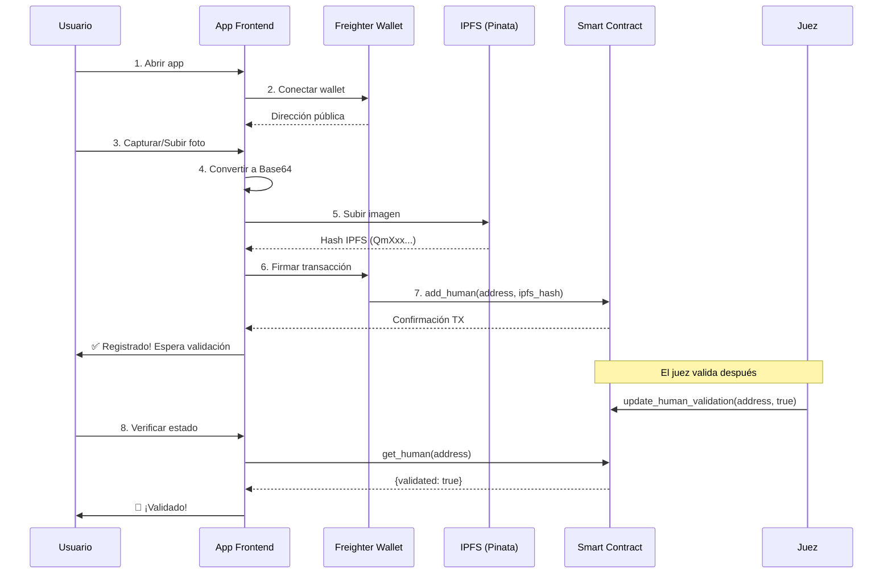

# 📱 Guía de Integración - APP de Usuario

> **Objetivo:** Usuario captura su foto, se registra en el contrato y espera validación del juez.

---

## 📋 Tabla de Contenidos

1. [Resumen del Flujo](#-resumen-del-flujo)
2. [Setup Inicial](#-setup-inicial)
3. [Servicios Requeridos](#-servicios-requeridos)
4. [Componentes de UI](#-componentes-de-ui)
5. [Integración Completa](#-integración-completa)
6. [Testing](#-testing)
7. [Troubleshooting](#-troubleshooting)

---

## 🎯 Resumen del Flujo



---

## 🔧 Setup Inicial

### 1. Instalación de Dependencias

```bash
npm install @stellar/stellar-sdk axios
# O con yarn
yarn add @stellar/stellar-sdk axios
```

### 2. Variables de Entorno

Crea `.env.local`:

```env
# Stellar Network
REACT_APP_NETWORK=testnet
REACT_APP_RPC_URL=https://soroban-testnet.stellar.org
REACT_APP_NETWORK_PASSPHRASE=Test SDF Network ; September 2015

# Event Distributor Contract
REACT_APP_CONTRACT_ID=CCHFGFX3S52UX46HZEBEGW5N2LDDYMSJDLZF4CQOZ6TSWWKFEG4TFPLS

# IPFS (Pinata)
REACT_APP_PINATA_API_KEY=tu_pinata_api_key
REACT_APP_PINATA_SECRET_KEY=tu_pinata_secret_key

# Opciones de IPFS (elegir una)
# REACT_APP_LIGHTHOUSE_API_KEY=tu_lighthouse_key
# REACT_APP_WEB3_STORAGE_TOKEN=tu_web3storage_token
```

---

## 📦 Servicios Requeridos

### Servicio 1: IPFS Upload (`services/ipfsService.js`)

```javascript
/**
 * services/ipfsService.js
 * Maneja la carga de imágenes Base64 a IPFS
 */

import axios from 'axios';

const PINATA_API_KEY = process.env.REACT_APP_PINATA_API_KEY;
const PINATA_SECRET_KEY = process.env.REACT_APP_PINATA_SECRET_KEY;
const PINATA_UPLOAD_URL = 'https://api.pinata.cloud/pinning/pinFileToIPFS';

/**
 * Convierte imagen Base64 a Blob
 * @param {string} base64String - "data:image/jpeg;base64,/9j/4AAQ..."
 * @returns {Blob}
 */
function base64ToBlob(base64String) {
  // Extraer el tipo de imagen y los datos
  const parts = base64String.split(',');
  const mimeType = parts[0].match(/:(.*?);/)?.[1] || 'image/jpeg';
  const base64Data = parts[1];
  
  // Decodificar Base64
  const byteCharacters = atob(base64Data);
  const byteNumbers = new Array(byteCharacters.length);
  
  for (let i = 0; i < byteCharacters.length; i++) {
    byteNumbers[i] = byteCharacters.charCodeAt(i);
  }
  
  const byteArray = new Uint8Array(byteNumbers);
  return new Blob([byteArray], { type: mimeType });
}

/**
 * Redimensiona imagen para optimizar tamaño
 * @param {string} base64Image - Imagen en Base64
 * @param {number} maxWidth - Ancho máximo (default: 800px)
 * @param {number} quality - Calidad JPEG (0.0 - 1.0, default: 0.85)
 * @returns {Promise<string>} - Imagen redimensionada en Base64
 */
export async function resizeImage(base64Image, maxWidth = 800, quality = 0.85) {
  return new Promise((resolve, reject) => {
    const img = new Image();
    
    img.onload = () => {
      const canvas = document.createElement('canvas');
      let width = img.width;
      let height = img.height;
      
      // Redimensionar si es necesario
      if (width > maxWidth) {
        const ratio = maxWidth / width;
        width = maxWidth;
        height = height * ratio;
      }
      
      canvas.width = width;
      canvas.height = height;
      
      const ctx = canvas.getContext('2d');
      ctx.drawImage(img, 0, 0, width, height);
      
      resolve(canvas.toDataURL('image/jpeg', quality));
    };
    
    img.onerror = () => reject(new Error('Error al cargar imagen'));
    img.src = base64Image;
  });
}

/**
 * Sube imagen Base64 a IPFS vía Pinata
 * @param {string} base64Image - Imagen en Base64
 * @param {object} options - Opciones adicionales
 * @returns {Promise<string>} - Hash IPFS (ej: "QmXxx...")
 */
export async function uploadImageToIPFS(base64Image, options = {}) {
  try {
    // Validar entrada
    if (!base64Image || typeof base64Image !== 'string') {
      throw new Error('Imagen Base64 inválida');
    }
    
    // Redimensionar imagen para ahorrar costos
    const resizedImage = await resizeImage(base64Image, 800, 0.85);
    
    // Convertir a Blob
    const blob = base64ToBlob(resizedImage);
    const formData = new FormData();
    
    // Generar nombre único
    const timestamp = Date.now();
    const filename = options.filename || `user-photo-${timestamp}.jpg`;
    formData.append('file', blob, filename);
    
    // Metadata para Pinata
    const metadata = JSON.stringify({
      name: filename,
      keyvalues: {
        app: 'refi-universe',
        type: 'user-photo',
        timestamp: new Date().toISOString(),
        ...options.metadata
      }
    });
    formData.append('pinataMetadata', metadata);
    
    // Opciones de pin
    const pinataOptions = JSON.stringify({
      cidVersion: 1
    });
    formData.append('pinataOptions', pinataOptions);
    
    // Subir a Pinata
    const response = await axios.post(PINATA_UPLOAD_URL, formData, {
      headers: {
        'Content-Type': 'multipart/form-data',
        'pinata_api_key': PINATA_API_KEY,
        'pinata_secret_api_key': PINATA_SECRET_KEY
      },
      timeout: 30000 // 30 segundos timeout
    });
    
    // Retornar hash IPFS
    const ipfsHash = response.data.IpfsHash;
    console.log('✅ Imagen subida a IPFS:', ipfsHash);
    return ipfsHash;
    
  } catch (error) {
    console.error('❌ Error subiendo a IPFS:', error);
    
    // Errores específicos
    if (error.code === 'ECONNABORTED') {
      throw new Error('Timeout: La carga de imagen tardó demasiado');
    }
    if (error.response?.status === 401) {
      throw new Error('API Keys de Pinata inválidas');
    }
    if (error.response?.status === 429) {
      throw new Error('Límite de API alcanzado. Intenta más tarde');
    }
    
    throw new Error(`Error al subir imagen: ${error.message}`);
  }
}

/**
 * Obtener URL pública de imagen IPFS
 * @param {string} ipfsHash - Hash IPFS
 * @returns {string} - URL pública
 */
export function getIPFSUrl(ipfsHash) {
  // Múltiples gateways para redundancia
  const gateways = [
    `https://gateway.pinata.cloud/ipfs/${ipfsHash}`,
    `https://ipfs.io/ipfs/${ipfsHash}`,
    `https://cloudflare-ipfs.com/ipfs/${ipfsHash}`
  ];
  
  return gateways[0]; // Usar Pinata como principal
}

/**
 * Verificar si imagen existe en IPFS
 * @param {string} ipfsHash - Hash IPFS
 * @returns {Promise<boolean>}
 */
export async function verifyIPFSImage(ipfsHash) {
  try {
    const url = getIPFSUrl(ipfsHash);
    const response = await axios.head(url, { timeout: 5000 });
    return response.status === 200;
  } catch (error) {
    return false;
  }
}
```

### Servicio 2: Stellar Contract (`services/stellarService.js`)

```javascript
/**
 * services/stellarService.js
 * Maneja interacciones con el contrato Event Distributor
 */

import {
  SorobanRpc,
  Contract,
  TransactionBuilder,
  Networks,
  BASE_FEE,
  nativeToScVal,
  Address,
  scValToNative
} from '@stellar/stellar-sdk';

// Configuración
const CONTRACT_ID = process.env.REACT_APP_CONTRACT_ID;
const NETWORK_PASSPHRASE = process.env.REACT_APP_NETWORK_PASSPHRASE || Networks.TESTNET;
const RPC_URL = process.env.REACT_APP_RPC_URL || 'https://soroban-testnet.stellar.org';

const server = new SorobanRpc.Server(RPC_URL);

/**
 * Verificar si Freighter está instalado
 * @returns {boolean}
 */
export function isFreighterInstalled() {
  return typeof window !== 'undefined' && !!window.freighter;
}

/**
 * Conectar wallet Freighter
 * @returns {Promise<string>} - Dirección pública del usuario
 */
export async function connectWallet() {
  if (!isFreighterInstalled()) {
    throw new Error('Freighter wallet no está instalado. Instálalo desde https://www.freighter.app/');
  }
  
  try {
    const publicKey = await window.freighter.getPublicKey();
    
    if (!publicKey) {
      throw new Error('No se pudo obtener la dirección pública');
    }
    
    console.log('✅ Wallet conectada:', publicKey);
    return publicKey;
    
  } catch (error) {
    if (error.message?.includes('User declined')) {
      throw new Error('Conexión rechazada por el usuario');
    }
    throw new Error(`Error conectando wallet: ${error.message}`);
  }
}

/**
 * Obtener network de Freighter
 * @returns {Promise<string>} - 'TESTNET' o 'PUBLIC'
 */
export async function getFreighterNetwork() {
  if (!isFreighterInstalled()) {
    throw new Error('Freighter no está instalado');
  }
  
  return await window.freighter.getNetwork();
}

/**
 * Verificar que la wallet está en la red correcta
 * @returns {Promise<void>}
 */
export async function verifyNetwork() {
  const network = await getFreighterNetwork();
  const expectedNetwork = NETWORK_PASSPHRASE.includes('Test') ? 'TESTNET' : 'PUBLIC';
  
  if (network !== expectedNetwork) {
    throw new Error(`Cambia Freighter a ${expectedNetwork}`);
  }
}

/**
 * Agregar usuario al contrato (registro inicial)
 * @param {string} userAddress - Dirección pública del usuario
 * @param {string} ipfsHash - Hash IPFS de la imagen
 * @returns {Promise<object>} - {txHash, status, explorerUrl}
 */
export async function registerUser(userAddress, ipfsHash) {
  try {
    // Validar parámetros
    if (!userAddress || !ipfsHash) {
      throw new Error('Dirección y hash IPFS son requeridos');
    }
    
    // Verificar red
    await verifyNetwork();
    
    // Obtener account
    const sourceAccount = await server.getAccount(userAddress);
    
    // Crear contrato
    const contract = new Contract(CONTRACT_ID);
    
    // Preparar parámetros
    const addressParam = new Address(userAddress).toScVal();
    const ipfsHashParam = nativeToScVal(ipfsHash, { type: 'string' });
    
    // Construir transacción
    const transaction = new TransactionBuilder(sourceAccount, {
      fee: BASE_FEE,
      networkPassphrase: NETWORK_PASSPHRASE
    })
      .addOperation(
        contract.call('add_human', addressParam, ipfsHashParam)
      )
      .setTimeout(180)
      .build();
    
    // Simular para preparar
    console.log('⏳ Simulando transacción...');
    const preparedTx = await server.prepareTransaction(transaction);
    
    // Firmar con Freighter
    console.log('⏳ Esperando firma del usuario...');
    const signedXDR = await window.freighter.signTransaction(
      preparedTx.toXDR(),
      {
        network: NETWORK_PASSPHRASE.includes('Test') ? 'TESTNET' : 'PUBLIC',
        networkPassphrase: NETWORK_PASSPHRASE
      }
    );
    
    // Enviar transacción
    console.log('⏳ Enviando transacción...');
    const txFromXDR = TransactionBuilder.fromXDR(signedXDR, NETWORK_PASSPHRASE);
    const sendResponse = await server.sendTransaction(txFromXDR);
    
    // Esperar confirmación
    console.log('⏳ Esperando confirmación...');
    let txStatus = await server.getTransaction(sendResponse.hash);
    let attempts = 0;
    const maxAttempts = 30;
    
    while (txStatus.status === 'NOT_FOUND' && attempts < maxAttempts) {
      await new Promise(resolve => setTimeout(resolve, 1000));
      txStatus = await server.getTransaction(sendResponse.hash);
      attempts++;
    }
    
    if (txStatus.status === 'SUCCESS') {
      console.log('✅ Transacción exitosa:', sendResponse.hash);
      
      return {
        txHash: sendResponse.hash,
        status: 'success',
        explorerUrl: `https://stellar.expert/explorer/testnet/tx/${sendResponse.hash}`
      };
    } else {
      throw new Error(`Transacción falló: ${txStatus.status}`);
    }
    
  } catch (error) {
    console.error('❌ Error en registerUser:', error);
    
    // Errores específicos
    if (error.message?.includes('User declined')) {
      throw new Error('Transacción rechazada por el usuario');
    }
    if (error.message?.includes('HumanAlreadyExists')) {
      throw new Error('Ya estás registrado en el sistema');
    }
    if (error.message?.includes('insufficient funds')) {
      throw new Error('Fondos insuficientes. Necesitas XLM en tu wallet');
    }
    
    throw error;
  }
}

/**
 * Obtener información de un usuario
 * @param {string} address - Dirección del usuario
 * @returns {Promise<object>} - {address, ipfsHash, validated}
 */
export async function getUserInfo(address) {
  try {
    const contract = new Contract(CONTRACT_ID);
    
    // Usar cuenta dummy para read-only
    const dummyAccount = await server.getAccount(
      'GAAAAAAAAAAAAAAAAAAAAAAAAAAAAAAAAAAAAAAAAAAAAAAAAAAAAWHF'
    );
    
    const transaction = new TransactionBuilder(dummyAccount, {
      fee: BASE_FEE,
      networkPassphrase: NETWORK_PASSPHRASE
    })
      .addOperation(
        contract.call('get_human', new Address(address).toScVal())
      )
      .setTimeout(180)
      .build();
    
    const result = await server.simulateTransaction(transaction);
    
    if (result.results?.[0]?.retval) {
      const retval = result.results[0].retval;
      
      return {
        address: scValToNative(retval.value()[0].val()),
        ipfsHash: scValToNative(retval.value()[1].val()),
        validated: scValToNative(retval.value()[2].val())
      };
    }
    
    return null;
    
  } catch (error) {
    if (error.message?.includes('HumanNotFound')) {
      return null;
    }
    throw error;
  }
}

/**
 * Verificar si usuario está registrado
 * @param {string} address - Dirección del usuario
 * @returns {Promise<boolean>}
 */
export async function isUserRegistered(address) {
  const userInfo = await getUserInfo(address);
  return userInfo !== null;
}

/**
 * Verificar si usuario está validado
 * @param {string} address - Dirección del usuario
 * @returns {Promise<boolean>}
 */
export async function isUserValidated(address) {
  const userInfo = await getUserInfo(address);
  return userInfo?.validated || false;
}

/**
 * Obtener balance de XLM
 * @param {string} address - Dirección
 * @returns {Promise<string>} - Balance en XLM
 */
export async function getXLMBalance(address) {
  try {
    const account = await server.getAccount(address);
    const xlmBalance = account.balances.find(b => b.asset_type === 'native');
    return xlmBalance?.balance || '0';
  } catch (error) {
    return '0';
  }
}
```

---

## 🎨 Componentes de UI

### Componente Principal: User Registration

```jsx
/**
 * components/UserRegistration.jsx
 * Componente principal para registro de usuario
 */

import React, { useState, useEffect, useRef } from 'react';
import { uploadImageToIPFS, getIPFSUrl } from '../services/ipfsService';
import {
  connectWallet,
  registerUser,
  getUserInfo,
  isFreighterInstalled,
  getXLMBalance
} from '../services/stellarService';
import './UserRegistration.css';

function UserRegistration() {
  // Estados
  const [step, setStep] = useState('connect'); // connect, capture, preview, uploading, success
  const [walletAddress, setWalletAddress] = useState('');
  const [balance, setBalance] = useState('0');
  const [imageBase64, setImageBase64] = useState('');
  const [ipfsHash, setIpfsHash] = useState('');
  const [userInfo, setUserInfo] = useState(null);
  const [txHash, setTxHash] = useState('');
  const [loading, setLoading] = useState(false);
  const [error, setError] = useState('');
  const [progress, setProgress] = useState('');
  
  const videoRef = useRef(null);
  const streamRef = useRef(null);

  // Verificar Freighter al cargar
  useEffect(() => {
    if (!isFreighterInstalled()) {
      setError('⚠️ Necesitas instalar Freighter Wallet');
    }
  }, []);

  // Conectar wallet
  const handleConnectWallet = async () => {
    try {
      setLoading(true);
      setError('');
      
      const address = await connectWallet();
      setWalletAddress(address);
      
      // Obtener balance
      const bal = await getXLMBalance(address);
      setBalance(bal);
      
      // Verificar si ya está registrado
      const info = await getUserInfo(address);
      
      if (info) {
        setUserInfo(info);
        setIpfsHash(info.ipfsHash);
        setStep('success');
        setProgress(info.validated ? '✅ Validado' : '⏳ Pendiente de validación');
      } else {
        setStep('capture');
      }
      
    } catch (err) {
      setError(err.message);
    } finally {
      setLoading(false);
    }
  };

  // Abrir cámara
  const handleOpenCamera = async () => {
    try {
      const stream = await navigator.mediaDevices.getUserMedia({
        video: { facingMode: 'user', width: 640, height: 480 }
      });
      
      if (videoRef.current) {
        videoRef.current.srcObject = stream;
        streamRef.current = stream;
      }
    } catch (err) {
      setError('No se pudo acceder a la cámara');
    }
  };

  // Capturar foto
  const handleCapturePhoto = () => {
    if (!videoRef.current) return;
    
    const canvas = document.createElement('canvas');
    canvas.width = videoRef.current.videoWidth;
    canvas.height = videoRef.current.videoHeight;
    
    const ctx = canvas.getContext('2d');
    ctx.drawImage(videoRef.current, 0, 0);
    
    const base64 = canvas.toDataURL('image/jpeg', 0.85);
    setImageBase64(base64);
    setStep('preview');
    
    // Detener cámara
    if (streamRef.current) {
      streamRef.current.getTracks().forEach(track => track.stop());
    }
  };

  // Subir desde archivo
  const handleFileUpload = (e) => {
    const file = e.target.files[0];
    if (!file) return;
    
    const reader = new FileReader();
    reader.onloadend = () => {
      setImageBase64(reader.result);
      setStep('preview');
    };
    reader.readAsDataURL(file);
  };

  // Registrar en blockchain
  const handleRegister = async () => {
    try {
      setLoading(true);
      setError('');
      setStep('uploading');
      
      // 1. Subir a IPFS
      setProgress('📤 Subiendo imagen a IPFS...');
      const hash = await uploadImageToIPFS(imageBase64, {
        metadata: {
          wallet: walletAddress,
          timestamp: Date.now()
        }
      });
      setIpfsHash(hash);
      
      // 2. Registrar en contrato
      setProgress('⏳ Registrando en blockchain...');
      const result = await registerUser(walletAddress, hash);
      setTxHash(result.txHash);
      
      // 3. Éxito
      setStep('success');
      setProgress('⏳ Pendiente de validación por el juez');
      
      // Actualizar info
      const info = await getUserInfo(walletAddress);
      setUserInfo(info);
      
    } catch (err) {
      setError(err.message);
      setStep('preview');
    } finally {
      setLoading(false);
    }
  };

  // Verificar validación
  const handleCheckValidation = async () => {
    try {
      setLoading(true);
      const info = await getUserInfo(walletAddress);
      setUserInfo(info);
      
      if (info.validated) {
        setProgress('✅ ¡Validado! Ya puedes participar en eventos');
      } else {
        setProgress('⏳ Aún pendiente de validación');
      }
    } catch (err) {
      setError(err.message);
    } finally {
      setLoading(false);
    }
  };

  // Render
  return (
    <div className="user-registration">
      <div className="header">
        <h1>🌍 ReFi Universe</h1>
        <p>Registro de Participante</p>
      </div>

      {/* Wallet Info */}
      {walletAddress && (
        <div className="wallet-info">
          <div className="address">
            <span className="label">Wallet:</span>
            <span className="value">{walletAddress.slice(0, 8)}...{walletAddress.slice(-4)}</span>
          </div>
          <div className="balance">
            <span className="label">Balance:</span>
            <span className="value">{parseFloat(balance).toFixed(2)} XLM</span>
          </div>
        </div>
      )}

      {/* Error */}
      {error && (
        <div className="alert alert-error">
          ❌ {error}
        </div>
      )}

      {/* Progress */}
      {progress && (
        <div className="alert alert-info">
          {progress}
        </div>
      )}

      {/* STEP 1: Connect Wallet */}
      {step === 'connect' && (
        <div className="step-connect">
          <div className="icon">🔗</div>
          <h2>Conecta tu Wallet</h2>
          <p>Necesitas Freighter Wallet para continuar</p>
          
          {!isFreighterInstalled() ? (
            <a 
              href="https://www.freighter.app/" 
              target="_blank" 
              rel="noopener noreferrer"
              className="btn btn-primary"
            >
              Instalar Freighter
            </a>
          ) : (
            <button 
              onClick={handleConnectWallet}
              disabled={loading}
              className="btn btn-primary"
            >
              {loading ? '⏳ Conectando...' : '🔗 Conectar Wallet'}
            </button>
          )}
        </div>
      )}

      {/* STEP 2: Capture Photo */}
      {step === 'capture' && (
        <div className="step-capture">
          <h2>📸 Captura tu Foto</h2>
          <p>Necesitamos una foto clara de tu rostro</p>
          
          <div className="camera-container">
            <video 
              ref={videoRef}
              autoPlay 
              playsInline
              className="video-preview"
            />
          </div>
          
          <div className="actions">
            <button 
              onClick={handleOpenCamera}
              className="btn btn-secondary"
            >
              📷 Abrir Cámara
            </button>
            
            <button 
              onClick={handleCapturePhoto}
              className="btn btn-primary"
            >
              📸 Capturar
            </button>
            
            <label className="btn btn-secondary">
              📁 Subir Archivo
              <input 
                type="file" 
                accept="image/*"
                onChange={handleFileUpload}
                style={{display: 'none'}}
              />
            </label>
          </div>
        </div>
      )}

      {/* STEP 3: Preview */}
      {step === 'preview' && (
        <div className="step-preview">
          <h2>👀 Vista Previa</h2>
          <p>¿Esta foto está bien?</p>
          
          <div className="image-preview">
            
          </div>
          
          <div className="actions">
            <button 
              onClick={() => {
                setImageBase64('');
                setStep('capture');
              }}
              className="btn btn-secondary"
            >
              🔄 Tomar Otra
            </button>
            
            <button 
              onClick={handleRegister}
              disabled={loading}
              className="btn btn-primary"
            >
              {loading ? '⏳ Procesando...' : '✅ Confirmar y Registrar'}
            </button>
          </div>
        </div>
      )}

      {/* STEP 4: Uploading */}
      {step === 'uploading' && (
        <div className="step-uploading">
          <div className="spinner"></div>
          <h2>⏳ Procesando...</h2>
          <p>{progress}</p>
        </div>
      )}

      {/* STEP 5: Success */}
      {step === 'success' && (
        <div className="step-success">
          <div className="icon">
            {userInfo?.validated ? '🎉' : '⏳'}
          </div>
          
          <h2>
            {userInfo?.validated ? '¡Validado!' : '¡Registrado!'}
          </h2>
          
          <p>
            {userInfo?.validated 
              ? 'Ya puedes participar en eventos de distribución'
              : 'Tu foto está siendo revisada por el juez'
            }
          </p>
          
          {ipfsHash && (
            <div className="image-preview">
              
            </div>
          )}
          
          <div className="info-box">
            <div className="info-row">
              <span className="label">Estado:</span>
              <span className={`badge ${userInfo?.validated ? 'validated' : 'pending'}`}>
                {userInfo?.validated ? '✅ Validado' : '⏳ Pendiente'}
              </span>
            </div>
            
            {txHash && (
              <div className="info-row">
                <span className="label">TX Hash:</span>
                <a 
                  href={`https://stellar.expert/explorer/testnet/tx/${txHash}`}
                  target="_blank"
                  rel="noopener noreferrer"
                  className="link"
                >
                  {txHash.slice(0, 16)}...
                </a>
              </div>
            )}
            
            {ipfsHash && (
              <div className="info-row">
                <span className="label">IPFS:</span>
                <a 
                  href={getIPFSUrl(ipfsHash)}
                  target="_blank"
                  rel="noopener noreferrer"
                  className="link"
                >
                  {ipfsHash.slice(0, 16)}...
                </a>
              </div>
            )}
          </div>
          
          {!userInfo?.validated && (
            <button 
              onClick={handleCheckValidation}
              disabled={loading}
              className="btn btn-secondary"
            >
              🔄 Verificar Estado
            </button>
          )}
        </div>
      )}
    </div>
  );
}

export default UserRegistration;
```

### Estilos CSS

```css
/**
 * components/UserRegistration.css
 */

.user-registration {
  max-width: 600px;
  margin: 0 auto;
  padding: 20px;
  font-family: -apple-system, BlinkMacSystemFont, 'Segoe UI', Roboto, Oxygen, Ubuntu, Cantarell, sans-serif;
}

.header {
  text-align: center;
  margin-bottom: 30px;
}

.header h1 {
  font-size: 2.5em;
  margin-bottom: 10px;
  color: #7D00FF;
}

.header p {
  color: #666;
  font-size: 1.1em;
}

.wallet-info {
  background: #f5f5f5;
  border-radius: 12px;
  padding: 15px;
  margin-bottom: 20px;
  display: flex;
  justify-content: space-between;
  align-items: center;
}

.wallet-info .label {
  color: #666;
  font-size: 0.9em;
  margin-right: 8px;
}

.wallet-info .value {
  font-weight: 600;
  color: #333;
}

.alert {
  padding: 15px;
  border-radius: 8px;
  margin-bottom: 20px;
  font-size: 0.95em;
}

.alert-error {
  background: #ffebee;
  color: #c62828;
  border: 1px solid #ef9a9a;
}

.alert-info {
  background: #e3f2fd;
  color: #1565c0;
  border: 1px solid #90caf9;
}

.step-connect,
.step-capture,
.step-preview,
.step-uploading,
.step-success {
  text-align: center;
}

.icon {
  font-size: 5em;
  margin-bottom: 20px;
}

.btn {
  padding: 12px 24px;
  border: none;
  border-radius: 8px;
  font-size: 1em;
  font-weight: 600;
  cursor: pointer;
  transition: all 0.3s ease;
  margin: 5px;
}

.btn:disabled {
  opacity: 0.5;
  cursor: not-allowed;
}

.btn-primary {
  background: #7D00FF;
  color: white;
}

.btn-primary:hover:not(:disabled) {
  background: #6300cc;
  transform: translateY(-2px);
  box-shadow: 0 4px 12px rgba(125, 0, 255, 0.3);
}

.btn-secondary {
  background: #e0e0e0;
  color: #333;
}

.btn-secondary:hover:not(:disabled) {
  background: #d0d0d0;
}

.camera-container {
  margin: 20px 0;
  border-radius: 12px;
  overflow: hidden;
  background: #000;
}

.video-preview {
  width: 100%;
  max-width: 480px;
  display: block;
}

.image-preview {
  margin: 20px 0;
  border-radius: 12px;
  overflow: hidden;
  box-shadow: 0 4px 12px rgba(0, 0, 0, 0.1);
}

.image-preview img {
  width: 100%;
  max-width: 400px;
  display: block;
}

.actions {
  display: flex;
  justify-content: center;
  flex-wrap: wrap;
  gap: 10px;
  margin-top: 20px;
}

.spinner {
  width: 50px;
  height: 50px;
  border: 4px solid #f3f3f3;
  border-top: 4px solid #7D00FF;
  border-radius: 50%;
  animation: spin 1s linear infinite;
  margin: 20px auto;
}

@keyframes spin {
  0% { transform: rotate(0deg); }
  100% { transform: rotate(360deg); }
}

.info-box {
  background: #f9f9f9;
  border-radius: 12px;
  padding: 20px;
  margin: 20px 0;
  text-align: left;
}

.info-row {
  display: flex;
  justify-content: space-between;
  align-items: center;
  margin-bottom: 12px;
  padding-bottom: 12px;
  border-bottom: 1px solid #e0e0e0;
}

.info-row:last-child {
  margin-bottom: 0;
  padding-bottom: 0;
  border-bottom: none;
}

.badge {
  padding: 4px 12px;
  border-radius: 20px;
  font-size: 0.85em;
  font-weight: 600;
}

.badge.validated {
  background: #c8e6c9;
  color: #2e7d32;
}

.badge.pending {
  background: #fff9c4;
  color: #f57f17;
}

.link {
  color: #7D00FF;
  text-decoration: none;
  font-family: monospace;
}

.link:hover {
  text-decoration: underline;
}

/* Responsive */
@media (max-width: 600px) {
  .user-registration {
    padding: 10px;
  }
  
  .header h1 {
    font-size: 2em;
  }
  
  .wallet-info {
    flex-direction: column;
    gap: 10px;
  }
  
  .actions {
    flex-direction: column;
  }
  
  .btn {
    width: 100%;
  }
}
```

---

## 🧪 Testing

### Test Manual

```javascript
// test/userFlow.test.js

// 1. Conectar wallet
const address = await connectWallet();
console.log('Wallet:', address);

// 2. Verificar si ya está registrado
const isRegistered = await isUserRegistered(address);
console.log('¿Registrado?:', isRegistered);

// 3. Si no está registrado, simular registro
if (!isRegistered) {
  const testImage = 'data:image/jpeg;base64,/9j/4AAQSkZJRg...';
  
  const ipfsHash = await uploadImageToIPFS(testImage);
  console.log('IPFS Hash:', ipfsHash);
  
  const result = await registerUser(address, ipfsHash);
  console.log('TX Hash:', result.txHash);
}

// 4. Obtener info
const userInfo = await getUserInfo(address);
console.log('User Info:', userInfo);

// 5. Verificar validación
const isValidated = await isUserValidated(address);
console.log('¿Validado?:', isValidated);
```

---

## 🐛 Troubleshooting

### Error: "Freighter no está instalado"
**Solución:** Instalar desde https://www.freighter.app/

### Error: "Insufficient funds"
**Solución:** Fondear cuenta con Friendbot:
```bash
curl "https://friendbot.stellar.org?addr=TU_DIRECCION_PUBLICA"
```

### Error: "Human already exists"
**Solución:** El usuario ya está registrado. Verificar con `getUserInfo()`

### Error: "IPFS timeout"
**Solución:** 
- Reducir tamaño de imagen
- Verificar API keys de Pinata
- Reintentar la operación

### Error: "User declined transaction"
**Solución:** El usuario rechazó la firma. Pedir que intente de nuevo.

---

## 📱 Soporte Mobile

### Captura desde cámara mobile
```jsx
<input 
  type="file" 
  accept="image/*" 
  capture="user"  // Cámara frontal
  onChange={handleFileUpload}
/>
```

### PWA Configuration
```json
{
  "name": "ReFi Universe",
  "short_name": "ReFi",
  "start_url": "/",
  "display": "standalone",
  "background_color": "#ffffff",
  "theme_color": "#7D00FF",
  "icons": [
    {
      "src": "/icon-192.png",
      "sizes": "192x192",
      "type": "image/png"
    }
  ]
}
```

---

## 🔗 Recursos

- **Contract ID:** `CCHFGFX3S52UX46HZEBEGW5N2LDDYMSJDLZF4CQOZ6TSWWKFEG4TFPLS`
- **Explorer:** https://stellar.expert/explorer/testnet/contract/CCHFGFX3S52UX46HZEBEGW5N2LDDYMSJDLZF4CQOZ6TSWWKFEG4TFPLS
- **Freighter:** https://www.freighter.app/
- **Friendbot:** https://laboratory.stellar.org/#account-creator?network=test
- **Pinata:** https://pinata.cloud/

---

**✅ ¡Listo para implementar!**
