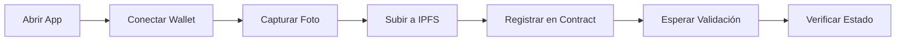
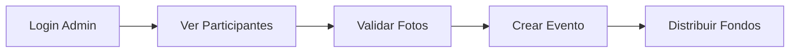

# 🎨 UI Integration Guides

Guías completas para integrar el frontend con los smart contracts de ReFi Universe.

---

## 📚 Guías Disponibles

### 📱 [GUIDE_INTEGRATION_APP.md](GUIDE_INTEGRATION_APP.md)
**Para: App de Usuario (Participantes)**

Flujo completo para que los usuarios:
- 📸 Capturen su foto (cámara o upload)
- 📤 Suban imagen a IPFS
- 🔗 Conecten su wallet Freighter
- ✅ Se registren en el contrato
- 🔍 Verifiquen su estado de validación

**Incluye:**
- Componente React completo (`UserRegistration.jsx`)
- Servicios de IPFS y Stellar
- CSS responsive
- Soporte mobile/PWA
- Manejo de errores

---

### 👨‍⚖️ [GUIDE_INTEGRATION_JUDGE.md](GUIDE_INTEGRATION_JUDGE.md)
**Para: App del Juez (Administrador)**

Dashboard completo para que el juez:
- 👥 Vea galería de participantes
- ✅ Valide o rechace fotos
- 🎪 Cree eventos
- 💰 Distribuya fondos
- 📊 Monitoree estadísticas

**Incluye:**
- `JudgeDashboard.jsx` - Dashboard principal
- `ParticipantGallery.jsx` - Galería con validación
- `EventManager.jsx` - Gestor de eventos
- CSS profesional
- Paginación y filtros

---

## 🚀 Quick Start

### 1. Instalación
```bash
npm install @stellar/stellar-sdk axios
```

### 2. Variables de Entorno
```env
# .env.local
REACT_APP_CONTRACT_ID=CCHFGFX3S52UX46HZEBEGW5N2LDDYMSJDLZF4CQOZ6TSWWKFEG4TFPLS
REACT_APP_NETWORK=testnet
REACT_APP_RPC_URL=https://soroban-testnet.stellar.org
REACT_APP_PINATA_API_KEY=tu_api_key
REACT_APP_PINATA_SECRET_KEY=tu_secret_key
```

### 3. Estructura de Carpetas
```
src/
├── services/
│   ├── ipfsService.js          # Subir imágenes a IPFS
│   ├── stellarService.js       # Usuario: conectar wallet, registrar
│   └── judgeContractService.js # Juez: validar, crear eventos
├── components/
│   ├── UserRegistration.jsx    # App de usuario
│   ├── JudgeDashboard.jsx      # Dashboard del juez
│   ├── ParticipantGallery.jsx  # Galería de fotos
│   └── EventManager.jsx        # Gestor de eventos
└── App.js
```

---

## 🎯 Flujos de Usuario

### Usuario (Participante)


### Juez (Admin)


---

## 📊 Funciones del Contrato

### Para Usuarios (Read-Only)
| Función | Descripción |
|---------|-------------|
| `get_human(address)` | Obtener info del usuario |
| `get_admin()` | Ver dirección admin |

### Para Usuarios (Write - Requiere Firma)
| Función | Descripción |
|---------|-------------|
| `add_human(address, ipfs_hash)` | Registrarse (automático vía admin) |

### Para Juez (Admin Only)
| Función | Descripción |
|---------|-------------|
| `get_all_humans(start, limit)` | Lista paginada |
| `get_validated_humans()` | Solo validados |
| `update_human_validation(addr, bool)` | Validar/rechazar |
| `update_human_image(addr, ipfs)` | Cambiar imagen |
| `create_event(name, addresses[])` | Crear evento |
| `get_events(start, limit)` | Lista eventos |
| `distribute_to_event(id, token, pool)` | Distribuir fondos |

---

## 🛠️ Componentes Técnicos

### IPFS Service
```javascript
// Redimensionar y subir imagen
const ipfsHash = await uploadImageToIPFS(base64Image);
// Resultado: "QmXxx..."
```

### Stellar Service
```javascript
// Conectar wallet
const address = await connectWallet();

// Registrar usuario
const tx = await registerUser(address, ipfsHash);

// Verificar estado
const info = await getUserInfo(address);
```

### Judge Service
```javascript
// Validar participante
await updateHumanValidation(adminAddr, userAddr, true);

// Crear evento
const event = await createEvent(adminAddr, "Evento X", [addr1, addr2]);

// Ver estadísticas
const stats = await getContractStats();
```

---

## 📱 Soporte Mobile

Ambas guías incluyen:
- ✅ Captura de cámara mobile
- ✅ Diseño responsive
- ✅ PWA configuration
- ✅ Touch-friendly UI

---

## 🔧 Testing

### Test de Usuario
```javascript
// 1. Conectar
const addr = await connectWallet();

// 2. Subir imagen
const hash = await uploadImageToIPFS(imageBase64);

// 3. Registrar
const tx = await registerUser(addr, hash);

// 4. Verificar
const info = await getUserInfo(addr);
console.log('Validado:', info.validated);
```

### Test de Juez
```javascript
// 1. Conectar admin
const adminAddr = await connectAdminWallet();

// 2. Ver pendientes
const pending = await getAllHumans(0, 10);

// 3. Validar
await updateHumanValidation(adminAddr, pending[0].address, true);

// 4. Crear evento
const validated = await getValidatedHumans();
await createEvent(adminAddr, "Test", validated);
```

---

## 🎨 UI/UX Features

### App de Usuario
- ✅ Estados de carga claros
- ✅ Preview de imagen antes de enviar
- ✅ Feedback visual de validación
- ✅ Links a explorer
- ✅ Información de TX

### App de Juez
- ✅ Dashboard con estadísticas
- ✅ Galería con grid responsive
- ✅ Filtros (todos/validados/pendientes)
- ✅ Modal para ver imagen completa
- ✅ Validación en batch
- ✅ Selector de participantes
- ✅ Confirmaciones de acciones

---

## 🐛 Troubleshooting

### Errores Comunes

**"Freighter not installed"**
→ Instalar desde https://www.freighter.app/

**"Insufficient funds"**
→ Usar Friendbot: https://laboratory.stellar.org/#account-creator?network=test

**"IPFS timeout"**
→ Reducir tamaño de imagen o verificar API keys

**"Human already exists"**
→ Usuario ya registrado. Usar `getUserInfo()` para verificar

**"No tienes permisos"**
→ Solo el admin puede ejecutar operaciones de validación

---

## 🔗 Recursos

**Contract ID:**
```
CCHFGFX3S52UX46HZEBEGW5N2LDDYMSJDLZF4CQOZ6TSWWKFEG4TFPLS
```

**Links:**
- 🔍 [Contract Explorer](https://stellar.expert/explorer/testnet/contract/CCHFGFX3S52UX46HZEBEGW5N2LDDYMSJDLZF4CQOZ6TSWWKFEG4TFPLS)
- 💾 [Source Code](https://github.com/refiup/sc)
- 💰 [Friendbot (Fondear cuenta)](https://laboratory.stellar.org/#account-creator?network=test)
- 🔐 [Freighter Wallet](https://www.freighter.app/)
- 📦 [Pinata IPFS](https://pinata.cloud/)

---

## 📞 Soporte

**¿Dudas o problemas?**
- 📖 Lee las guías completas
- 🐛 [Reporta issues](https://github.com/refiup/sc/issues)
- 💬 Revisa la sección de Troubleshooting

---

## ✅ Checklist de Implementación

### Usuario App
- [ ] Instalar dependencias
- [ ] Configurar variables de entorno
- [ ] Copiar `services/ipfsService.js`
- [ ] Copiar `services/stellarService.js`
- [ ] Implementar `UserRegistration.jsx`
- [ ] Agregar CSS
- [ ] Probar flujo completo

### Juez App
- [ ] Instalar dependencias
- [ ] Configurar variables de entorno
- [ ] Copiar `services/judgeContractService.js`
- [ ] Implementar `JudgeDashboard.jsx`
- [ ] Implementar `ParticipantGallery.jsx`
- [ ] Implementar `EventManager.jsx`
- [ ] Agregar CSS
- [ ] Probar con cuenta admin

---

**🎉 ¡Todo listo para construir las apps!**

**Next Steps:**
1. Lee la guía correspondiente a tu rol (Usuario o Juez)
2. Copia los servicios y componentes
3. Configura las variables de entorno
4. Prueba en testnet
5. ¡Deploy!
